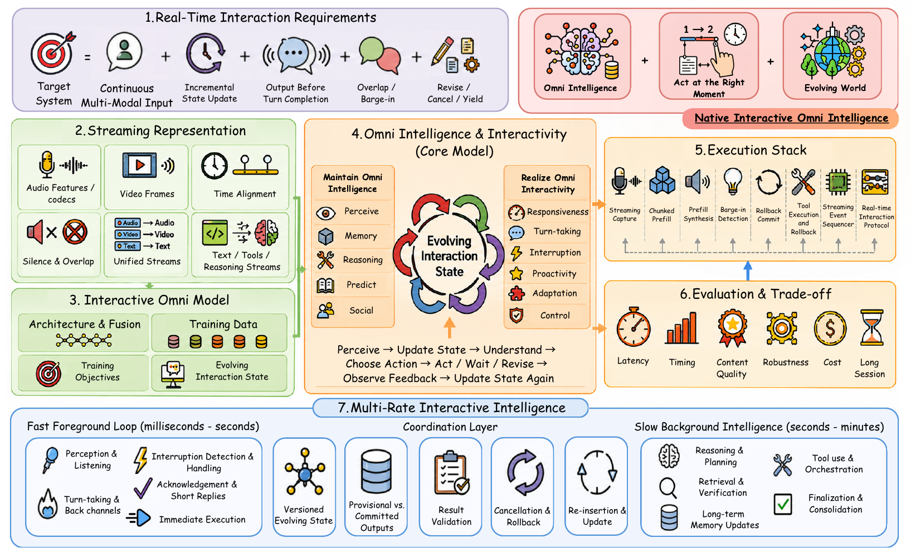

# Awesome Interactive Omni Intelligence

<div align="center">

<h3><a href="survey/survey.pdf">Towards Native Real-Time Interactive Omni Intelligence</a></h3>

Yifan Shen<sup>1,∗</sup>, Zhuoqing Zhong<sup>2,∗</sup>, Xinzhuo Li<sup>1,∗</sup>, Jiateng Liu<sup>1,∗</sup>, Bingxuan Li<sup>1,∗</sup>, Wei Cao<sup>1,∗</sup>,<br>
Pei Tian<sup>3</sup>, Lin Zhu<sup>1</sup>, Jian Xu<sup>1</sup>, Zewei Chen<sup>1</sup>, Tianjiao Yu<sup>1</sup>, Haichao Zhang<sup>4</sup>, Jiawen Zhang<sup>1</sup>,<br>
Yuner Zhang<sup>5</sup>, Brian Nlong Zhao<sup>1</sup>, Sen Fang<sup>6</sup>, Nan Huang<sup>1</sup>, Bowen Fang<sup>3</sup>, Chen Fang<sup>1</sup>, Boyi Li<sup>1</sup>,<br>
Onkar Susladkar<sup>1</sup>, Frank Yang<sup>1</sup>, Yuanzhe Liu<sup>1</sup>, Jingyuan Zhu<sup>5</sup>, Cheng Qian<sup>1</sup>, Yijiang Li<sup>7</sup>, Xinyang Han<sup>8</sup>, Yuan Shen<sup>1</sup>,<br>
Xiang Li<sup>1</sup>, Bolin Lai<sup>1</sup>, Xu Cao<sup>1</sup>, Chengde Wan<sup>9</sup>, Yiwen Song<sup>10</sup>, Yue Guo<sup>1</sup>, Heng Ji<sup>1</sup>, Xuan Di<sup>3</sup>,<br>
Yiwei Wang<sup>11</sup>, Yaoyao Liu<sup>1</sup>, Dimitris N. Metaxas<sup>6</sup>, Yun Fu<sup>4</sup>, James M. Rehg<sup>1</sup>, Chengxiang Zhai<sup>1</sup>,<br>
Ismini Lourentzou<sup>1,†</sup>

<sup>1</sup>University of Illinois Urbana-Champaign &nbsp;&nbsp; <sup>2</sup>Carnegie Mellon University<br>
<sup>3</sup>Columbia University &nbsp;&nbsp; <sup>4</sup>Northeastern University &nbsp;&nbsp; <sup>5</sup>University of Pennsylvania<br>
<sup>6</sup>Rutgers University &nbsp;&nbsp; <sup>7</sup>University of California, San Diego<br>
<sup>8</sup>University of California, Berkeley &nbsp;&nbsp; <sup>9</sup>Independent Researcher &nbsp;&nbsp; <sup>10</sup>Google<br>
<sup>11</sup>University of California, Merced

<sup>∗</sup>Core Contributor &nbsp;&nbsp;&nbsp; <sup>†</sup>Corresponding Author

</div>

**[📄 Survey](survey/survey.pdf) · [📚 Paper tables](#models) · [📊 Benchmarks](#benchmarks) · [🤝 Contributing](#contributing) · [📝 Citation](#citation)**

<a id="interaction-contract"></a>
The survey connects **omni intelligence** (understanding, reasoning and memory) with **omni interactivity** (when to speak, wait, act or revise). Its real-time interaction requirements are continuous input, incremental state updates and output that can change during an ongoing interaction.



<a id="contents"></a>
<a id="explore"></a>
## 📋 Table of Contents

- [🧩 Models and architectures](#models)
  - [Omni input and output models](#models-omni-input-and-output-models)
  - [Speech-native full-duplex models](#models-speech-native-full-duplex-models)
  - [Cascaded and adapted systems](#models-cascaded-and-adapted-systems)
  - [Foreground–background designs](#models-foregroundbackground-designs)
  - [Fusion and specialization](#models-fusion-and-specialization)
  - [Commercial real-time systems](#models-commercial-real-time-systems)
- [🌊 Streaming representations](#representations)
  - [Audio features and semantic units](#representations-audio-features-and-semantic-units)
  - [Neural codecs and speech generation](#representations-neural-codecs-and-speech-generation)
  - [Video streams and temporal compression](#representations-video-streams-and-temporal-compression)
  - [Time, silence and overlap](#representations-time-silence-and-overlap)
  - [Unified streams and asynchronous results](#representations-unified-streams-and-asynchronous-results)
- [🛠️ Data and training](#training)
  - [Natural conversation and duplex dialogue](#training-natural-conversation-and-duplex-dialogue)
  - [Speech perception and generation corpora](#training-speech-perception-and-generation-corpora)
  - [Audiovisual grounding](#training-audiovisual-grounding)
  - [Instruction and synthetic interaction data](#training-instruction-and-synthetic-interaction-data)
  - [Content, timing and preference objectives](#training-content-timing-and-preference-objectives)
  - [Reasoning and coordination supervision](#training-reasoning-and-coordination-supervision)
- [🧠 Maintaining omni intelligence](#intelligence)
  - [Temporal grounding and event understanding](#intelligence-temporal-grounding-and-event-understanding)
  - [Memory and session state](#intelligence-memory-and-session-state)
  - [Reasoning and tools under real-time constraints](#intelligence-reasoning-and-tools-under-real-time-constraints)
  - [Factual grounding and capability preservation](#intelligence-factual-grounding-and-capability-preservation)
  - [Social and pragmatic understanding](#intelligence-social-and-pragmatic-understanding)
- [⚡ Realizing omni interactivity](#interactivity)
  - [Latency and responsiveness](#interactivity-latency-and-responsiveness)
  - [Turn-taking, silence and backchannels](#interactivity-turn-taking-silence-and-backchannels)
  - [Interruption, yielding and repair](#interactivity-interruption-yielding-and-repair)
  - [Proactivity and adaptation](#interactivity-proactivity-and-adaptation)
  - [Serving, memory and client coordination](#interactivity-serving-memory-and-client-coordination)
- [📊 Evaluation and benchmarks](#benchmarks)
  - [Full-duplex spoken interaction](#benchmarks-full-duplex-spoken-interaction)
  - [Streaming and proactive omni interaction](#benchmarks-streaming-and-proactive-omni-interaction)
  - [Spoken and multimodal intelligence](#benchmarks-spoken-and-multimodal-intelligence)
  - [Memory and temporal-grounding primitives](#benchmarks-memory-and-temporal-grounding-primitives)
  - [Turn-taking and representation primitives](#benchmarks-turn-taking-and-representation-primitives)
  - [Safety, privacy and overlap stress tests](#benchmarks-safety-privacy-and-overlap-stress-tests)
- [🔄 Multi-rate interactive intelligence](#multi-rate)
  - [Concurrent thinking and speaking](#multi-rate-concurrent-thinking-and-speaking)
  - [Asynchronous retrieval, tools and memory](#multi-rate-asynchronous-retrieval-tools-and-memory)
  - [Preserving capability during adaptation](#multi-rate-preserving-capability-during-adaptation)
  - [Runtime coordination and resource budgets](#multi-rate-runtime-coordination-and-resource-budgets)
- [🔭 Open problems and research directions](#open-problems)
  - [Joint intelligence–interactivity evaluation](#open-problems-joint-intelligenceinteractivity-evaluation)
  - [Persistent and proactive interaction](#open-problems-persistent-and-proactive-interaction)
  - [Social, multilingual and controllable interaction](#open-problems-social-multilingual-and-controllable-interaction)
  - [Safe and efficient open-world operation](#open-problems-safe-and-efficient-open-world-operation)
- [📖 Related surveys and foundations](#foundations)
  - [Related surveys and reviews](#foundations-related-surveys-and-reviews)
  - [Speech and audio foundations](#foundations-speech-and-audio-foundations)
  - [Language and multimodal backbones](#foundations-language-and-multimodal-backbones)
  - [Efficient training and inference](#foundations-efficient-training-and-inference)
  - [Agent control and reasoning](#foundations-agent-control-and-reasoning)
  - [Spatial, 3D and embodied foundations](#foundations-spatial-3d-and-embodied-foundations)
  - [Evaluation tools and risk frameworks](#foundations-evaluation-tools-and-risk-frameworks)
  - [Sign language and pose-native generation](#foundations-sign-language-and-pose-native-generation)
- [🤝 Contributing](#contributing)
- [📝 Citation](#citation)
- [📎 Additional resources](#additional-resources)
- [🔗 Related collections](#related-collections)

<a id="models"></a>
## 🧩 Models and architectures

Compare systems by the state that receives new evidence and controls ongoing output. Adapted and model-native systems are two development paths; foreground–background coordination can be added across both. **Survey §2, 4.1.**

<a id="models-omni-input-and-output-models"></a>
### Omni input and output models

Broad modality support and streaming generation must be distinguished from the ability to update an active response.

| Paper | Venue | Code |
| --- | :---: | :---: |
| [Ex-Omni-2D: Expressive omni-modal dialogue models with native visual presence](https://arxiv.org/abs/2608.10720) | arXiv 2026 | [Code](https://github.com/LOGO-CUHKSZ/Ex-Omni-2D-Code) |
| [MiniCPM-o 4.5: Towards real-time full-duplex omni-modal interaction](https://arxiv.org/abs/2604.27393) | arXiv 2026 | [Code](https://github.com/OpenBMB/MiniCPM-o) |
| [MiniMind-o technical report: An open small-scale speech-native omni model](https://arxiv.org/abs/2605.03937) | arXiv 2026 | [Code](https://github.com/jingyaogong/minimind-o) |
| [Qwen3.5-Omni technical report](https://arxiv.org/abs/2604.15804) | arXiv 2026 | — |
| [ROMA: Real-time omni-multimodal assistant with interactive streaming understanding](https://aclanthology.org/2026.findings-acl.1153/) | ACL Findings 2026 | [Code](https://github.com/Eureka-Maggie/ROMA) |
| [InteractiveOmni: A unified omni-modal model for audio-visual multi-turn dialogue](https://arxiv.org/abs/2510.13747) | arXiv 2025 | [Code](https://github.com/SenseTime-FVG/InteractiveOmni) |
| [LLaMA-Omni 2: LLM-Based Real-Time Spoken Chatbot with Autoregressive Streaming Speech Synthesis](https://aclanthology.org/2025.acl-long.912/) | ACL 2025 | [Code](https://github.com/ictnlp/LLaMA-Omni2) |
| [LLaMA-Omni: Seamless speech interaction with large language models](https://openreview.net/forum?id=PYmrUQmMEw) | ICLR 2025 | [Code](https://github.com/ictnlp/LLaMA-Omni) |
| [Qwen2.5-Omni technical report](https://arxiv.org/abs/2503.20215) | arXiv 2025 | [Code](https://github.com/QwenLM/Qwen2.5-Omni) |
| [Qwen3-Omni technical report](https://arxiv.org/abs/2509.17765) | arXiv 2025 | [Code](https://github.com/QwenLM/Qwen3-Omni) |
| [Vita-1.5: Towards GPT-4o level real-time vision and speech interaction](https://proceedings.neurips.cc/paper_files/paper/2025/hash/6ce9d51dded7dac82b3b4d3dbb1d73bc-Abstract-Conference.html) | NeurIPS 2025 | [Code](https://github.com/VITA-MLLM/VITA) |
| [AnyGPT: Unified multimodal LLM with discrete sequence modeling](https://aclanthology.org/2024.acl-long.521/) | ACL 2024 | [Code](https://github.com/OpenMOSS/AnyGPT) |
| [Mini-Omni2: Towards open-source GPT-4o with vision, speech and duplex capabilities](https://arxiv.org/abs/2410.11190) | arXiv 2024 | [Code](https://github.com/gpt-omni/mini-omni2) |
| [Mini-Omni: Language models can hear, talk while thinking in streaming](https://arxiv.org/abs/2408.16725) | arXiv 2024 | [Code](https://github.com/gpt-omni/mini-omni) |
| [VITA: Towards open-source interactive omni multimodal LLM](https://arxiv.org/abs/2408.05211) | arXiv 2024 | [Code](https://github.com/VITA-MLLM/VITA) |

<a id="models-speech-native-full-duplex-models"></a>
### Speech-native full-duplex models

Paired or synchronized streams expose silence, overlap and speaking/listening decisions to the model.

| Paper | Venue | Code |
| --- | :---: | :---: |
| [BayLing-Duplex: Native full-duplex speech dialogue with a single autoregressive LLM](https://arxiv.org/abs/2606.14528) | arXiv 2026 | [Code](https://github.com/BayLing-Models/BayLing-Duplex) |
| [DuplexSLA: A full-duplex spoken language model with synchronized speech, language, and action](https://arxiv.org/abs/2605.20755) | arXiv 2026 | [Code](https://github.com/hyzhang24/DuplexSLA) |
| [JoyAI-Talker: Full-duplex speech interactive large model built for empathetic voice agents](https://arxiv.org/abs/2608.01119) | arXiv 2026 | — |
| [PersonaPlex: Voice and role control for full duplex conversational speech models](https://doi.org/10.1109/ICASSP55912.2026.11463413) | ICASSP 2026 | [Code](https://github.com/NVIDIA/personaplex) |
| [TurnGuide: Enhancing meaningful full duplex spoken interactions via dynamic turn-level text-speech interleaving](https://arxiv.org/abs/2508.07375) | Interspeech 2026 | [Code](https://github.com/dreamtheater123/TurnGuide) |
| [Language model can listen while speaking](https://ojs.aaai.org/index.php/AAAI/article/view/34665) | AAAI 2025 | [Project](https://ddlbojack.github.io/LSLM) |
| [NTPP: Generative speech language modeling for dual-channel spoken dialogue via next-token-pair prediction](https://proceedings.mlr.press/v267/wang25by.html) | ICML 2025 | [Code](https://github.com/Chaos96/NTPP) |
| [SALMONN-omni: A standalone speech LLM without codec injection for full-duplex conversation](https://proceedings.neurips.cc/paper_files/paper/2025/hash/233aee920dab065709145371b5900b8f-Abstract-Conference.html) | NeurIPS 2025 | [Code](https://github.com/bytedance/SALMONN) |
| [Beyond turn-based interfaces: Synchronous LLMs as full-duplex dialogue agents](https://aclanthology.org/2024.emnlp-main.1192/) | EMNLP 2024 | [Project](https://syncllm.cs.washington.edu/) |
| [Moshi: a speech-text foundation model for real-time dialogue](https://doi.org/10.48550/arXiv.2410.00037) | arXiv 2024 | [Code](https://github.com/kyutai-labs/moshi) |
| [SALMONN-omni: A codec-free LLM for full-duplex speech understanding and generation](https://arxiv.org/abs/2411.18138) | arXiv 2024 | [Code](https://github.com/bytedance/SALMONN) |
| [Generative spoken dialogue language modeling](https://aclanthology.org/2023.tacl-1.15/) | TACL 2023 | [Code](https://github.com/facebookresearch/fairseq/tree/main/examples/textless_nlp/dgslm) |

<a id="models-cascaded-and-adapted-systems"></a>
### Cascaded and adapted systems

Streaming recognition, language reasoning and synthesis may be separately trained, with timing managed by orchestration.

| Paper | Venue | Code |
| --- | :---: | :---: |
| [CrossOracle: An agentic framework for real-time expert personas with parallelized acoustic synthesis](https://aclanthology.org/2026.sigdial-1.18/) | SIGDIAL 2026 | — |
| [UAF: A unified audio front-end LLM for full-duplex speech interaction](https://arxiv.org/abs/2604.19221) | arXiv 2026 | — |
| [ChipChat: Low-latency cascaded conversational agent in MLX](https://machinelearning.apple.com/research/chipchat) | ASRU 2025 | — |
| [Freeze-Omni: A smart and low latency speech-to-speech dialogue model with frozen LLM](https://proceedings.mlr.press/v267/wang25aw.html) | ICML 2025 | [Code](https://github.com/VITA-MLLM/Freeze-Omni) |
| [Robust speech recognition via large-scale weak supervision](https://proceedings.mlr.press/v202/radford23a.html) | ICML 2023 | [Code](https://github.com/openai/whisper) |
| [Low-latency incremental text-to-speech synthesis with distilled context prediction network](https://doi.org/10.1109/ASRU51503.2021.9687904) | ASRU 2021 | [Project](https://takaaki-saeki.github.io/itts_distil_demo/) |
| [Incremental text-to-speech synthesis with prefix-to-prefix framework](https://aclanthology.org/2020.findings-emnlp.346/) | EMNLP Findings 2020 | [Project](https://inctts.github.io/) |
| [Sequence transduction with recurrent neural networks](https://arxiv.org/abs/1211.3711) | ICML Workshop 2012 | — |

<a id="models-foregroundbackground-designs"></a>
### Foreground–background designs

Low-latency interaction can run alongside retrieval, reasoning, memory or tools. The same pattern may appear within one backbone or across multiple models.

| Paper | Venue | Code |
| --- | :---: | :---: |
| [DuplexOmni: Real-time listening, seeing, thinking, and speaking for full-duplex interaction](https://arxiv.org/abs/2606.09186) | arXiv 2026 | [Code](https://github.com/MuyeHuang/DuplexOmni) |
| [Interaction models: A scalable approach to human-ai collaboration](https://thinkingmachines.ai/blog/interaction-models/) | 2026 | — |
| [MoshiRAG: Asynchronous knowledge retrieval for full-duplex speech language models](https://icml.cc/virtual/2026/poster/66336) | ICML 2026 | [Code](https://github.com/kyutai-labs/moshi-rag) |
| [STITCH: Simultaneous thinking and talking with chunked reasoning for spoken language models](https://openreview.net/forum?id=5Z1eMhCeTb) | ICLR 2026 | [Code](https://github.com/d223302/STITCH) |
| [Stream rag: Instant and accurate spoken dialogue systems with streaming tool usage](https://arxiv.org/abs/2510.02044) | ICML 2026 | — |
| [StreamArena: Toward continuous, interactive, and long-horizon agentic streaming video understanding](https://arxiv.org/abs/2608.05703) | arXiv 2026 | [Code](https://github.com/JIA-Lab-research/StreamArena) |
| [EgoMem: Lifelong memory agent for full-duplex omnimodal models](https://arxiv.org/abs/2509.11914) | arXiv 2025 | — |

<a id="models-fusion-and-specialization"></a>
### Fusion and specialization

Compare encoders, token interfaces, early fusion and expert routing without assuming any one choice guarantees native interaction.

| Paper | Venue | Code |
| --- | :---: | :---: |
| [CogniRoute: Learning to route social evidence in omni-modal models](https://arxiv.org/abs/2606.20970) | arXiv 2026 | — |
| [JAVISDiT++: Unified modeling and optimization for joint audio-video generation](https://arxiv.org/abs/2602.19163) | ICLR 2026 | [Code](https://github.com/JavisVerse/JavisDiT) |
| [MoST: Mixing speech and text with modality-aware mixture of experts](https://arxiv.org/abs/2601.10272) | arXiv 2026 | [Code](https://github.com/NUS-HPC-AI-Lab/MoST) |
| [OmniEncoder: See, hear, and feel continuous motion like humans with one encoder](https://arxiv.org/abs/2605.01506) | arXiv 2026 | — |
| [DeepOmni: Towards seamless and smart speech interaction with adaptive modality-specific MoE](https://arxiv.org/abs/2506.21864) | arXiv 2025 | [Code](https://github.com/talkking/DeepTalk) |
| [Scaling laws for native multimodal models](https://openaccess.thecvf.com/content/ICCV2025/html/Shukor_Scaling_Laws_for_Native_Multimodal_Models_ICCV_2025_paper.html) | ICCV 2025 | [Code](https://github.com/apple/ml-l3m) |
| [Unveiling encoder-free vision-language models](https://proceedings.neurips.cc/paper_files/paper/2024/hash/5e2217482fa75556f1970be809acd3f8-Abstract-Conference.html) | NeurIPS 2024 | [Code](https://github.com/baaivision/EVE) |

<a id="models-commercial-real-time-systems"></a>
### Commercial real-time systems

Official model pages, release announcements, and system cards.

| Paper | Venue | Code |
| --- | :---: | :---: |
| [GPT-Realtime-2 model](https://developers.openai.com/api/docs/models/gpt-realtime-2) | 2026 | — |
| [Qwen3.5-Omni-Realtime: Real-time omni-modal interaction](https://docs.modelstudio.console.alibabacloud.com/en/model-studio/realtime) | 2026 | — |
| [SeedRealtime audio-visual full-duplex LLM released: Toward omni-modal natural interaction](https://seed.bytedance.com/en/blog/seedrealtime-audio-visual-full-duplex-llm-released-toward-omni-modal-natural-interaction) | 2026 | — |
| [Gemini live](https://gemini.google/overview/gemini-live/) | 2024 | — |
| [GPT-4o system card](https://arxiv.org/abs/2410.21276) | arXiv 2024 | — |

[↑ Contents](#contents) · [Detailed discussion](docs/models.md)

---

<a id="representations"></a>
## 🌊 Streaming representations

Time, silence, overlap and partial intent carry control information as well as content. The representation sets the update rate, the evidence visible to the model and the cost of keeping multiple streams active. **Survey §3.**

<a id="representations-audio-features-and-semantic-units"></a>
### Audio features and semantic units

Continuous features and semantic units trade acoustic detail, linguistic abstraction and token rate.

| Paper | Venue | Code |
| --- | :---: | :---: |
| [Codec does matter: Exploring the semantic shortcoming of codec for audio language model](https://ojs.aaai.org/index.php/AAAI/article/view/34761) | AAAI 2025 | [Code](https://github.com/zhenye234/xcodec) |
| [Speech discrete tokens or continuous features? a comparative analysis for spoken language understanding in SpeechLLMs](https://aclanthology.org/2025.emnlp-main.1266/) | EMNLP 2025 | — |
| [A comparative study of discrete speech tokens for semantic-related tasks with large language models](https://arxiv.org/abs/2411.08742) | arXiv 2024 | — |
| [dMel: Speech tokenization made simple](https://arxiv.org/abs/2407.15835) | arXiv 2024 | [Code](https://github.com/apple/dmel) |
| [WavLM: Large-Scale Self-Supervised Pre-Training for Full Stack Speech Processing](http://dx.doi.org/10.1109/JSTSP.2022.3188113) | IEEE JSTSP 2022 | [Code](https://github.com/microsoft/unilm/tree/master/wavlm) |
| [HuBERT: Self-supervised speech representation learning by masked prediction of hidden units](https://doi.org/10.1109/TASLP.2021.3122291) | IEEE TASLP 2021 | [Code](https://github.com/facebookresearch/fairseq/tree/main/examples/hubert) |
| [w2v-bert: Combining contrastive learning and masked language modeling for self-supervised speech pre-training](https://arxiv.org/abs/2108.06209) | ASRU 2021 | — |
| [vq-wav2vec: Self-supervised learning of discrete speech representations](https://iclr.cc/virtual_2020/poster_rylwJxrYDS.html) | ICLR 2020 | [Code](https://github.com/facebookresearch/fairseq/tree/main/examples/wav2vec) |
| [wav2vec 2.0: A framework for self-supervised learning of speech representations](https://proceedings.neurips.cc/paper/2020/hash/92d1e1eb1cd6f9fba3227870bb6d7f07-Abstract.html) | NeurIPS 2020 | [Code](https://github.com/facebookresearch/fairseq/tree/main/examples/wav2vec) |
| [Representation learning with contrastive predictive coding](https://arxiv.org/abs/1807.03748) | arXiv 2018 | — |

<a id="representations-neural-codecs-and-speech-generation"></a>
### Neural codecs and speech generation

Codecs and output schedules determine fidelity, bandwidth and the rate at which spoken output can be revised.

| Paper | Venue | Code |
| --- | :---: | :---: |
| [Autoregressive speech synthesis without vector quantization](https://aclanthology.org/2025.acl-long.65/) | ACL 2025 | [Project](https://www.microsoft.com/en-us/research/project/vall-e-x/melle/) |
| [Neural codec language models are zero-shot text to speech synthesizers](https://doi.org/10.1109/TASLPRO.2025.3530270) | IEEE TASLP 2025 | — |
| [TS3-Codec: Transformer-based simple streaming single codec](https://www.isca-archive.org/interspeech_2025/wu25f_interspeech.html) | Interspeech 2025 | — |
| [WavTokenizer: An efficient acoustic discrete codec tokenizer for audio language modeling](https://proceedings.iclr.cc/paper_files/paper/2025/hash/ea1f5f0878d43ff4fb8bf64ef4a2326c-Abstract-Conference.html) | ICLR 2025 | [Code](https://github.com/jishengpeng/WavTokenizer) |
| [BigCodec: Pushing the limits of low-bitrate neural speech codec](https://arxiv.org/abs/2409.05377) | arXiv 2024 | [Code](https://github.com/Aria-K-Alethia/BigCodec) |
| [NaturalSpeech 3: Zero-shot speech synthesis with factorized codec and diffusion models](https://proceedings.mlr.press/v235/ju24b.html) | ICML 2024 | [Code](https://github.com/open-mmlab/Amphion/tree/main/models/codec/ns3_codec) |
| [SNAC: Multi-scale neural audio codec](https://openreview.net/forum?id=PFBF5ctj4X) | NeurIPS Workshop 2024 | [Code](https://github.com/hubertsiuzdak/snac) |
| [SpeechTokenizer: Unified speech tokenizer for speech language models](https://openreview.net/forum?id=AF9Q8Vip84) | ICLR 2024 | [Code](https://github.com/ZhangXInFD/SpeechTokenizer) |
| [Vocos: Closing the gap between time-domain and fourier-based neural vocoders for high-quality audio synthesis](https://openreview.net/forum?id=vY9nzQmQBw) | ICLR 2024 | [Code](https://github.com/gemelo-ai/vocos) |
| [AudioLM: A language modeling approach to audio generation](https://doi.org/10.1109/TASLP.2023.3288409) | IEEE TASLP 2023 | [Project](https://google-research.github.io/seanet/audiolm/examples/) |
| [HiFi-Codec: Group-residual vector quantization for high fidelity audio codec](https://arxiv.org/abs/2305.02765) | arXiv 2023 | [Code](https://github.com/yangdongchao/AcademiCodec) |
| [High fidelity neural audio compression](https://openreview.net/forum?id=ivCd8z8zR2) | TMLR 2023 | [Code](https://github.com/facebookresearch/encodec) |
| [High-fidelity audio compression with improved RVQGAN](https://proceedings.neurips.cc/paper_files/paper/2023/hash/58d0e78cf042af5876e12661087bea12-Abstract-Conference.html) | NeurIPS 2023 | [Code](https://github.com/descriptinc/descript-audio-codec) |
| [SoundStream: An end-to-end neural audio codec](https://doi.org/10.1109/TASLP.2021.3129994) | IEEE TASLP 2022 | [Project](https://google-research.github.io/seanet/soundstream/examples/) |

<a id="representations-video-streams-and-temporal-compression"></a>
### Video streams and temporal compression

Retain the evidence needed for causal understanding while controlling visual-token and cache growth.

| Paper | Venue | Code |
| --- | :---: | :---: |
| [StreamingVLM: Real-Time Understanding for Infinite Video Streams](https://openreview.net/forum?id=gVbPWbA97s) | ICLR 2026 | [Code](https://github.com/mit-han-lab/streaming-vlm) |
| [Adaptive keyframe sampling for long video understanding](https://openaccess.thecvf.com/content/CVPR2025/html/Tang_Adaptive_Keyframe_Sampling_for_Long_Video_Understanding_CVPR_2025_paper.html) | CVPR 2025 | [Code](https://github.com/ncTimTang/AKS) |
| [Flash-VStream: Efficient Real-Time Understanding for Long Video Streams](https://openaccess.thecvf.com/content/ICCV2025/html/Zhang_Flash-VStream_Efficient_Real-Time_Understanding_for_Long_Video_Streams_ICCV_2025_paper.html) | ICCV 2025 | [Code](https://github.com/IVGSZ/Flash-VStream) |
| [Grounded-VideoLLM: Sharpening fine-grained temporal grounding in video large language models](https://aclanthology.org/2025.findings-emnlp.50/) | EMNLP Findings 2025 | [Code](https://github.com/WHB139426/Grounded-Video-LLM) |
| [TimeChat-Online: 80% visual tokens are naturally redundant in streaming videos](https://doi.org/10.1145/3746027.3754839) | ACM MM 2025 | [Code](https://github.com/yaolinli/TimeChat-Online) |
| [VideoRoPE: What makes for good video rotary position embedding?](https://proceedings.mlr.press/v267/wei25h.html) | ICML 2025 | [Code](https://github.com/Wiselnn570/VideoRoPE) |
| [LLaMA-VID: An image is worth 2 tokens in large language models](https://link.springer.com/chapter/10.1007/978-3-031-72952-2_19) | ECCV 2024 | [Code](https://github.com/JIA-Lab-research/LLaMA-VID) |
| [Motion2VecSets: 4D Latent Vector Set Diffusion for Non-rigid Shape Reconstruction and Tracking](https://openaccess.thecvf.com/content/CVPR2024/html/Cao_Motion2VecSets_4D_Latent_Vector_Set_Diffusion_for_Non-rigid_Shape_Reconstruction_CVPR_2024_paper.html) | CVPR 2024 | — |
| [TimeChat: A time-sensitive multimodal large language model for long video understanding](https://openaccess.thecvf.com/content/CVPR2024/html/Ren_TimeChat_A_Time-sensitive_Multimodal_Large_Language_Model_for_Long_Video_CVPR_2024_paper.html) | CVPR 2024 | [Code](https://github.com/RenShuhuai-Andy/TimeChat) |
| [VideoLLM-online: Online video large language model for streaming video](https://openaccess.thecvf.com/content/CVPR2024/html/Chen_VideoLLM-online_Online_Video_Large_Language_Model_for_Streaming_Video_CVPR_2024_paper.html) | CVPR 2024 | [Code](https://github.com/showlab/VideoLLM-online) |
| [VTimeLLM: Empower LLM to grasp video moments](https://openaccess.thecvf.com/content/CVPR2024/html/Huang_VTimeLLM_Empower_LLM_to_Grasp_Video_Moments_CVPR_2024_paper.html) | CVPR 2024 | [Code](https://github.com/huangb23/VTimeLLM) |
| [Token merging: Your ViT but faster](https://openreview.net/forum?id=JroZRaRw7Eu) | ICLR 2023 | [Code](https://github.com/facebookresearch/ToMe) |
| [Perceiver IO: A General Architecture for Structured Inputs and Outputs](https://openreview.net/forum?id=fILj7WpI-g) | ICLR 2022 | — |
| [Perceiver: General Perception with Iterative Attention](https://proceedings.mlr.press/v139/jaegle21a.html) | ICML 2021 | — |

<a id="representations-time-silence-and-overlap"></a>
### Time, silence and overlap

Represent conversational timing explicitly, including intervals in which waiting is the correct action.

| Paper | Venue | Code |
| --- | :---: | :---: |
| [Streaming sequence-to-sequence learning with delayed streams modeling](https://arxiv.org/abs/2509.08753) | arXiv 2025 | [Code](https://github.com/kyutai-labs/delayed-streams-modeling) |
| [Beyond turn-based interfaces: Synchronous LLMs as full-duplex dialogue agents](https://aclanthology.org/2024.emnlp-main.1192/) | EMNLP 2024 | [Project](https://syncllm.cs.washington.edu/) |
| [Real-time and continuous turn-taking prediction using voice activity projection](https://arxiv.org/abs/2401.04868) | IWSDS 2024 | [Code](https://github.com/inokoj/VAP-Realtime) |
| [Speech ReaLLM -- Real-time Speech Recognition with Multimodal Language Models by Teaching the Flow of Time](https://www.isca-archive.org/interspeech_2024/seide24_interspeech.html) | Interspeech 2024 | — |
| [Generative spoken dialogue language modeling](https://aclanthology.org/2023.tacl-1.15/) | TACL 2023 | [Code](https://github.com/facebookresearch/fairseq/tree/main/examples/textless_nlp/dgslm) |
| [What makes a good pause? investigating the turn-holding effects of fillers](https://www.internationalphoneticassociation.org/icphs-proceedings/ICPhS2023/full_papers/828.pdf) | ICPhS 2023 | [Code](https://github.com/ErikEkstedt/vap_fillers) |
| [How much does prosody help turn-taking? investigations using voice activity projection models](https://aclanthology.org/2022.sigdial-1.51/) | SIGDIAL 2022 | [Code](https://github.com/ErikEkstedt/VoiceActivityProjection) |
| [Voice Activity Projection: Self-supervised Learning of Turn-taking Events](https://www.isca-archive.org/interspeech_2022/ekstedt22_interspeech.html) | Interspeech 2022 | [Code](https://github.com/ErikEkstedt/VoiceActivityProjection) |
| [TurnGPT: a transformer-based language model for predicting turn-taking in spoken dialog](https://aclanthology.org/2020.findings-emnlp.268/) | EMNLP Findings 2020 | [Code](https://github.com/ErikEkstedt/TurnGPT) |

<a id="representations-unified-streams-and-asynchronous-results"></a>
### Unified streams and asynchronous results

Speech, text, visual updates and tool results need compatible temporal interfaces and provenance.

| Paper | Venue | Code |
| --- | :---: | :---: |
| [DuplexOmni: Real-time listening, seeing, thinking, and speaking for full-duplex interaction](https://arxiv.org/abs/2606.09186) | arXiv 2026 | [Code](https://github.com/MuyeHuang/DuplexOmni) |
| [STITCH: Simultaneous thinking and talking with chunked reasoning for spoken language models](https://openreview.net/forum?id=5Z1eMhCeTb) | ICLR 2026 | [Code](https://github.com/d223302/STITCH) |
| [Stream rag: Instant and accurate spoken dialogue systems with streaming tool usage](https://arxiv.org/abs/2510.02044) | ICML 2026 | — |
| [Qwen2.5-Omni technical report](https://arxiv.org/abs/2503.20215) | arXiv 2025 | [Code](https://github.com/QwenLM/Qwen2.5-Omni) |
| [Qwen3-Omni technical report](https://arxiv.org/abs/2509.17765) | arXiv 2025 | [Code](https://github.com/QwenLM/Qwen3-Omni) |
| [SpiRit-LM: Interleaved spoken and written language model](https://aclanthology.org/2025.tacl-1.2/) | TACL 2025 | [Code](https://github.com/facebookresearch/spiritlm) |
| [AnyGPT: Unified multimodal LLM with discrete sequence modeling](https://aclanthology.org/2024.acl-long.521/) | ACL 2024 | [Code](https://github.com/OpenMOSS/AnyGPT) |
| [Interleaved speech-text language models for simple streaming text-to-speech synthesis](https://arxiv.org/abs/2412.16102) | arXiv 2024 | — |
| [VoxtLM: Unified decoder-only models for consolidating speech recognition, synthesis and speech, text continuation tasks](https://doi.org/10.1109/ICASSP48485.2024.10447112) | ICASSP 2024 | [Code](https://github.com/espnet/espnet/tree/master/egs2/voxtlm_v1/lm1) |
| [WebGPT: Browser-Assisted Question-Answering with Human Feedback](https://arxiv.org/abs/2112.09332) | arXiv 2021 | — |

[↑ Contents](#contents) · [Detailed discussion](docs/representations.md)

---

<a id="training"></a>
## 🛠️ Data and training

Organize supervision by the behavior it teaches. Abundant speech and instruction data do not automatically supervise interruption, silence, repair or asynchronous result insertion. **Survey §4.2–4.3.**

<a id="training-natural-conversation-and-duplex-dialogue"></a>
### Natural conversation and duplex dialogue

Speaker-separated audio preserves turn transitions, backchannels and overlap; record release conditions before reuse.

| Paper | Venue | Code |
| --- | :---: | :---: |
| [DuplexChat: Constructing speaker-separated full-duplex dialogue speech at scale for spoken dialogue language modeling](https://arxiv.org/abs/2607.04941) | arXiv 2026 | [Code](https://github.com/sarulab-speech/DuplexChat) |
| [Full-duplex interaction in spoken dialogue systems: A comprehensive study from the icassp 2026 HumDial challenge](https://arxiv.org/abs/2604.21406) | arXiv 2026 | [Code](https://github.com/ASLP-lab/HumDial-FDBench) |
| [Open-source full-duplex conversational datasets for natural and interactive speech synthesis](https://doi.org/10.3724/2096-7004.di.2026.00d2) | Data Intelligence 2026 | [Dataset](https://magichub.com/datasets/multi-stream-spontaneous-conversation-training-datasets_english/) |
| [Dialospeech: Dual-speaker dialogue generation with LLM and flow matching](https://doi.org/10.1109/APSIPAASC65261.2025.11249327) | APSIPA ASC 2025 | [Project](https://tiamojames.github.io/DialoSpeech/) |
| [The fisher corpus: a resource for the next generations of speech-to-text](https://aclanthology.org/L04-1500/) | LREC 2004 | [Dataset](https://catalog.ldc.upenn.edu/LDC2004S13) |
| [CALLHOME Collection in Six Languages](https://linguistlist.org/issues/8/1209/) | 1997 | — |
| [Switchboard: telephone speech corpus for research and development](https://doi.org/10.1109/ICASSP.1992.225858) | ICASSP 1992 | [Dataset](https://catalog.ldc.upenn.edu/LDC97S62) |

<a id="training-speech-perception-and-generation-corpora"></a>
### Speech perception and generation corpora

Foundational speech data supplies recognition and generation capability; dataset names and scales depend on the release.

| Paper | Venue | Code |
| --- | :---: | :---: |
| [GigaSpeech 2: An evolving, large-scale and multi-domain ASR corpus for low-resource languages with automated crawling, transcription and refinement](https://aclanthology.org/2025.acl-long.135/) | ACL 2025 | [Code](https://github.com/SpeechColab/GigaSpeech2) |
| [Emilia: An extensive, multilingual, and diverse speech dataset for large-scale speech generation](https://arxiv.org/abs/2407.05361) | SLT 2024 | [Code](https://github.com/open-mmlab/Amphion/tree/main/preprocessors/Emilia) |
| [Fish-Speech: Leveraging large language models for advanced multilingual text-to-speech synthesis](https://arxiv.org/abs/2411.01156) | arXiv 2024 | [Code](https://github.com/fishaudio/fish-speech) |
| [LibriHeavy: a 50,000 hours ASR corpus with punctuation casing and context](https://arxiv.org/abs/2309.08105) | ICASSP 2024 | [Code](https://github.com/k2-fsa/libriheavy) |
| [WavCaps: A chatgpt-assisted weakly-labelled audio captioning dataset for audio-language multimodal research](http://dx.doi.org/10.1109/TASLP.2024.3419446) | IEEE TASLP 2024 | [Code](https://github.com/XinhaoMei/WavCaps) |
| [WenetSpeech4TTS: A 12,800-hour mandarin TTS corpus for large speech generation model benchmark](https://www.isca-archive.org/interspeech_2024/ma24d_interspeech.html) | Interspeech 2024 | [Code](https://github.com/dukGuo/valle-audiodec) |
| [LibriTTS-R: A restored multi-speaker text-to-speech corpus](https://www.isca-archive.org/interspeech_2023/koizumi23_interspeech.html) | Interspeech 2023 | [Dataset](https://www.openslr.org/141/) |
| [Yodas: Youtube-oriented dataset for audio and speech](https://arxiv.org/abs/2406.00899) | ASRU 2023 | [Dataset](https://huggingface.co/datasets/espnet/yodas) |
| [WenetSpeech: A 10000+ hours multi-domain mandarin corpus for speech recognition](https://arxiv.org/abs/2110.03370) | ICASSP 2022 | [Code](https://github.com/wenet-e2e/WenetSpeech) |
| [GigaSpeech: An evolving, multi-domain ASR corpus with 10,000 hours of transcribed audio](http://dx.doi.org/10.21437/Interspeech.2021-1965) | Interspeech 2021 | [Code](https://github.com/SpeechColab/GigaSpeech) |
| [The people’s speech: A large-scale diverse english speech recognition dataset for commercial usage](https://datasets-benchmarks-proceedings.neurips.cc/paper_files/paper/2021/hash/202cb962ac59075b964b07152d234b70-Abstract-round1.html) | NeurIPS 2021 | [Code](https://github.com/mlcommons/peoples-speech) |
| [VoxPopuli: A large-scale multilingual speech corpus for representation learning, semi-supervised learning and interpretation](https://aclanthology.org/2021.acl-long.80/) | ACL 2021 | [Code](https://github.com/facebookresearch/voxpopuli) |
| [Common voice: A massively-multilingual speech corpus](https://aclanthology.org/2020.lrec-1.520/) | LREC 2020 | [Code](https://github.com/common-voice/common-voice) |
| [Libri-Light: A benchmark for ASR with limited or no supervision](http://dx.doi.org/10.1109/ICASSP40776.2020.9052942) | ICASSP 2020 | [Code](https://github.com/facebookresearch/libri-light) |
| [Mls: A large-scale multilingual dataset for speech research](http://dx.doi.org/10.21437/Interspeech.2020-2826) | Interspeech 2020 | [Dataset](https://www.openslr.org/94/) |
| [LibriTTS: A corpus derived from librispeech for text-to-speech](https://www.isca-archive.org/interspeech_2019/zen19_interspeech.html) | Interspeech 2019 | [Dataset](https://www.openslr.org/60/) |
| [Librispeech: An ASR corpus based on public domain audio books](https://doi.org/10.1109/ICASSP.2015.7178964) | ICASSP 2015 | [Dataset](https://www.openslr.org/12) |

<a id="training-audiovisual-grounding"></a>
### Audiovisual grounding

Time-aligned audio and video teach what happened and when, but may lack response-policy annotations.

| Paper | Venue | Code |
| --- | :---: | :---: |
| [Perception test: A diagnostic benchmark for multimodal video models](https://proceedings.neurips.cc/paper_files/paper/2023/hash/8540fba4abdc7f9f7a7b1cc6cd60e409-Abstract.html) | NeurIPS 2023 | [Code](https://github.com/google-deepmind/perception_test) |
| [Ego4D: Around the world in 3,000 hours of egocentric video](https://openaccess.thecvf.com/content/CVPR2022/html/Grauman_Ego4D_Around_the_World_in_3000_Hours_of_Egocentric_Video_CVPR_2022_paper.html) | CVPR 2022 | [Code](https://github.com/facebookresearch/Ego4d) |
| [The benefit of temporally-strong labels in audio event classification](https://arxiv.org/abs/2105.07031) | ICASSP 2021 | [Dataset](https://research.google.com/audioset/download_strong.html) |
| [HowTo100M: Learning a Text-Video Embedding by Watching Hundred Million Narrated Video Clips](https://openaccess.thecvf.com/content_ICCV_2019/html/Miech_HowTo100M_Learning_a_Text-Video_Embedding_by_Watching_Hundred_Million_Narrated_ICCV_2019_paper.html) | ICCV 2019 | [Code](https://github.com/antoine77340/howto100m) |
| [Looking to listen at the cocktail party: a speaker-independent audio-visual model for speech separation](http://dx.doi.org/10.1145/3197517.3201357) | ACM TOG 2018 | [Project](https://looking-to-listen.github.io/) |
| [VoxCeleb2: Deep speaker recognition](http://dx.doi.org/10.21437/Interspeech.2018-1929) | Interspeech 2018 | [Code](https://github.com/a-nagrani/VGGVox) |
| [VoxCeleb: A Large-Scale Speaker Identification Dataset](https://www.isca-archive.org/interspeech_2017/nagrani17_interspeech.html) | Interspeech 2017 | [Code](https://github.com/a-nagrani/VGGVox) |

<a id="training-instruction-and-synthetic-interaction-data"></a>
### Instruction and synthetic interaction data

Synthetic instructions and temporal traces offer different supervision: response content versus the timing of interaction events.

| Paper | Venue | Code |
| --- | :---: | :---: |
| [DuplexGen: Adaptive synthesis of human-ai turn-taking dialogues](https://arxiv.org/abs/2607.26178) | EMNLP 2026 | [Code](https://github.com/duplexgen/duplexgen-code) |
| [DuplexOmni: Real-time listening, seeing, thinking, and speaking for full-duplex interaction](https://arxiv.org/abs/2606.09186) | arXiv 2026 | [Code](https://github.com/MuyeHuang/DuplexOmni) |
| [LLaMA-Omni 2: LLM-Based Real-Time Spoken Chatbot with Autoregressive Streaming Speech Synthesis](https://aclanthology.org/2025.acl-long.912/) | ACL 2025 | [Code](https://github.com/ictnlp/LLaMA-Omni2) |
| [LLaMA-Omni: Seamless speech interaction with large language models](https://openreview.net/forum?id=PYmrUQmMEw) | ICLR 2025 | [Code](https://github.com/ictnlp/LLaMA-Omni) |
| [OmniFlatten: An end-to-end GPT model for seamless voice conversation](https://aclanthology.org/2025.acl-long.709/) | ACL 2025 | [Project](https://omniflatten.github.io/) |
| [AnyGPT: Unified multimodal LLM with discrete sequence modeling](https://aclanthology.org/2024.acl-long.521/) | ACL 2024 | [Code](https://github.com/OpenMOSS/AnyGPT) |
| [Beyond turn-based interfaces: Synchronous LLMs as full-duplex dialogue agents](https://aclanthology.org/2024.emnlp-main.1192/) | EMNLP 2024 | [Project](https://syncllm.cs.washington.edu/) |
| [Mini-Omni: Language models can hear, talk while thinking in streaming](https://arxiv.org/abs/2408.16725) | arXiv 2024 | [Code](https://github.com/gpt-omni/mini-omni) |
| [Moshi: a speech-text foundation model for real-time dialogue](https://doi.org/10.48550/arXiv.2410.00037) | arXiv 2024 | [Code](https://github.com/kyutai-labs/moshi) |
| [Enhancing chat language models by scaling high-quality instructional conversations](https://aclanthology.org/2023.emnlp-main.183/) | EMNLP 2023 | [Code](https://github.com/thunlp/UltraChat) |
| [OpenHermes 2.5: An open dataset of synthetic data for generalist LLM assistants](https://huggingface.co/datasets/teknium/OpenHermes-2.5) | 2023 | — |
| [SpeechGPT: Empowering large language models with intrinsic cross-modal conversational abilities](https://aclanthology.org/2023.findings-emnlp.1055/) | EMNLP Findings 2023 | [Code](https://github.com/0nutation/SpeechGPT) |
| [Stanford Alpaca: An instruction-following Llama model](https://github.com/tatsu-lab/stanford_alpaca) | 2023 | [Code](https://github.com/tatsu-lab/stanford_alpaca) |

<a id="training-content-timing-and-preference-objectives"></a>
### Content, timing and preference objectives

Separate linguistic quality, speech generation and turn-control objectives so that gains on one axis can be checked against losses on another.

| Paper | Venue | Code |
| --- | :---: | :---: |
| [ASPIRin: Action space projection for interactivity-optimized reinforcement learning in full-duplex speech language models](https://arxiv.org/abs/2604.10065) | arXiv 2026 | — |
| [Decoupling conversational dynamics in full-duplex spoken models through reinforcement learning](https://arxiv.org/abs/2607.07148) | arXiv 2026 | — |
| [Multi-faceted interactivity alignment in full-duplex speech models](https://arxiv.org/abs/2606.11167) | EMNLP 2026 | [Model](https://huggingface.co/kyutai/personaplex-rl-seamless) |
| [Optimizing conversational quality in spoken dialogue systems with reinforcement learning from AI feedback](https://aclanthology.org/2026.findings-acl.2040/) | ACL Findings 2026 | — |
| [Toward cognitive supersensing in multimodal large language model](https://arxiv.org/abs/2602.01541) | arXiv 2026 | [Code](https://github.com/PediaMedAI/Cognition-MLLM) |
| [Align-SLM: Textless spoken language models with reinforcement learning from AI feedback](https://aclanthology.org/2025.acl-long.997/) | ACL 2025 | — |
| [Fine-grained preference optimization improves spatial reasoning in VLMs](https://proceedings.neurips.cc/paper_files/paper/2025/hash/1a17a06de88cf77f25cda0da91615a54-Abstract-Conference.html) | NeurIPS 2025 | [Code](https://github.com/PLAN-Lab/SpatialReasonerR1) |
| [Qwen2.5-Omni technical report](https://arxiv.org/abs/2503.20215) | arXiv 2025 | [Code](https://github.com/QwenLM/Qwen2.5-Omni) |
| [SALMONN-omni: A codec-free LLM for full-duplex speech understanding and generation](https://arxiv.org/abs/2411.18138) | arXiv 2024 | [Code](https://github.com/bytedance/SALMONN) |
| [SpeechAlign: Aligning speech generation to human preferences](https://proceedings.neurips.cc/paper_files/paper/2024/hash/5a016da670821af25f151f523a2e563f-Abstract-Conference.html) | NeurIPS 2024 | [Code](https://github.com/0nutation/SpeechGPT) |
| [Direct preference optimization: Your language model is secretly a reward model](https://proceedings.neurips.cc/paper_files/paper/2023/hash/a85b405ed65c6477a4fe8302b5e06ce7-Abstract-Conference.html) | NeurIPS 2023 | [Code](https://github.com/eric-mitchell/direct-preference-optimization) |

<a id="training-reasoning-and-coordination-supervision"></a>
### Reasoning and coordination supervision

Training traces should expose thinking, delegation, result arrival and changes to the current request.

| Paper | Venue | Code |
| --- | :---: | :---: |
| [DuplexOmni: Real-time listening, seeing, thinking, and speaking for full-duplex interaction](https://arxiv.org/abs/2606.09186) | arXiv 2026 | [Code](https://github.com/MuyeHuang/DuplexOmni) |
| [STITCH: Simultaneous thinking and talking with chunked reasoning for spoken language models](https://openreview.net/forum?id=5Z1eMhCeTb) | ICLR 2026 | [Code](https://github.com/d223302/STITCH) |
| [Stream rag: Instant and accurate spoken dialogue systems with streaming tool usage](https://arxiv.org/abs/2510.02044) | ICML 2026 | — |
| [The silent thought: Modeling internal cognition in full-duplex spoken dialogue models via latent reasoning](https://arxiv.org/abs/2603.17837) | ICML 2026 | — |
| [EgoMem: Lifelong memory agent for full-duplex omnimodal models](https://arxiv.org/abs/2509.11914) | arXiv 2025 | — |

[↑ Contents](#contents) · [Detailed discussion](docs/training.md)

---

<a id="intelligence"></a>
## 🧠 Maintaining omni intelligence

Interactive intelligence needs evolving temporal grounding, revisable memory and reasoning that can use incomplete evidence. A fluent response is useful only if it stays consistent with the current scene, user intent and available evidence. **Survey §5.**

<a id="intelligence-temporal-grounding-and-event-understanding"></a>
### Temporal grounding and event understanding

Bind objects, actions and speech to the correct moment while new observations arrive.

| Paper | Venue | Code |
| --- | :---: | :---: |
| [ChronoVision: Temporal reasoning via latent state reconstruction](https://arxiv.org/abs/2608.05631) | arXiv 2026 | — |
| [FineMoLA: Towards fine-grained motion-language alignment from clip-level supervision](https://openaccess.thecvf.com/content/CVPR2026W/HuMoGen/html/Wang_FineMoLA_Towards_Fine-Grained_Motion-Language_Alignment_from_Clip-Level_Supervision_CVPRW_2026_paper.html) | CVPRW 2026 | — |
| [StreamingBench: Assessing the gap for mllms to achieve streaming video understanding](https://doi.org/10.1109/ICASSP55912.2026.11463959) | ICASSP 2026 | [Code](https://github.com/THUNLP-MT/StreamingBench) |
| [StreamingVLM: Real-Time Understanding for Infinite Video Streams](https://openreview.net/forum?id=gVbPWbA97s) | ICLR 2026 | [Code](https://github.com/mit-han-lab/streaming-vlm) |
| [Grounded-VideoLLM: Sharpening fine-grained temporal grounding in video large language models](https://aclanthology.org/2025.findings-emnlp.50/) | EMNLP Findings 2025 | [Code](https://github.com/WHB139426/Grounded-Video-LLM) |
| [OmniMMI: A comprehensive multi-modal interaction benchmark in streaming video contexts](https://openaccess.thecvf.com/content/CVPR2025/html/Wang_OmniMMI_A_Comprehensive_Multi-modal_Interaction_Benchmark_in_Streaming_Video_Contexts_CVPR_2025_paper.html) | CVPR 2025 | [Code](https://github.com/OmniMMI/OmniMMI) |
| [Streaming video question-answering with in-context video kv-cache retrieval](https://proceedings.iclr.cc/paper_files/paper/2025/file/67a9b444cbcd647572c88194619f72d5-Paper-Conference.pdf) | ICLR 2025 | [Code](https://github.com/Becomebright/ReKV) |
| [VideoLLM knows when to speak: Enhancing time-sensitive video comprehension with video-text duet interaction format](https://aclanthology.org/2025.findings-emnlp.336/) | EMNLP Findings 2025 | [Code](https://github.com/yellow-binary-tree/MMDuet) |
| [TimeChat: A time-sensitive multimodal large language model for long video understanding](https://openaccess.thecvf.com/content/CVPR2024/html/Ren_TimeChat_A_Time-sensitive_Multimodal_Large_Language_Model_for_Long_Video_CVPR_2024_paper.html) | CVPR 2024 | [Code](https://github.com/RenShuhuai-Andy/TimeChat) |
| [VideoLLM-online: Online video large language model for streaming video](https://openaccess.thecvf.com/content/CVPR2024/html/Chen_VideoLLM-online_Online_Video_Large_Language_Model_for_Streaming_Video_CVPR_2024_paper.html) | CVPR 2024 | [Code](https://github.com/showlab/VideoLLM-online) |
| [VTimeLLM: Empower LLM to grasp video moments](https://openaccess.thecvf.com/content/CVPR2024/html/Huang_VTimeLLM_Empower_LLM_to_Grasp_Video_Moments_CVPR_2024_paper.html) | CVPR 2024 | [Code](https://github.com/huangb23/VTimeLLM) |

<a id="intelligence-memory-and-session-state"></a>
### Memory and session state

Preserve entity identity and task state while allowing corrections and invalidation of obsolete information.

| Paper | Venue | Code |
| --- | :---: | :---: |
| [APEX-MEM: Agentic semi-structured memory with temporal reasoning for long-term conversational AI](https://aclanthology.org/2026.acl-long.749/) | ACL 2026 | — |
| [Beyond retrieval: Progressive latent memory evolution for streaming video understanding](https://arxiv.org/abs/2609.04131) | arXiv 2026 | — |
| [MemORAI: Memory organization and retrieval via adaptive graph intelligence for LLM conversational agents](https://aclanthology.org/2026.findings-acl.1408/) | ACL Findings 2026 | — |
| [Scaling the long video understanding of multimodal large language models via visual memory mechanism](https://arxiv.org/abs/2603.29252) | CVPR 2026 | [Code](https://github.com/city1517/FlexMem) |
| [STALE: Can LLM agents know when their memories are no longer valid?](https://arxiv.org/abs/2605.06527) | arXiv 2026 | — |
| [StreamArena: Toward continuous, interactive, and long-horizon agentic streaming video understanding](https://arxiv.org/abs/2608.05703) | arXiv 2026 | [Code](https://github.com/JIA-Lab-research/StreamArena) |
| [EgoMem: Lifelong memory agent for full-duplex omnimodal models](https://arxiv.org/abs/2509.11914) | arXiv 2025 | — |
| [Flash-VStream: Efficient Real-Time Understanding for Long Video Streams](https://openaccess.thecvf.com/content/ICCV2025/html/Zhang_Flash-VStream_Efficient_Real-Time_Understanding_for_Long_Video_Streams_ICCV_2025_paper.html) | ICCV 2025 | [Code](https://github.com/IVGSZ/Flash-VStream) |
| [HiAgent: Hierarchical working memory management for solving long-horizon agent tasks with large language model](https://aclanthology.org/2025.acl-long.1575/) | ACL 2025 | [Code](https://github.com/HiAgent2024/HiAgent) |
| [LongMemEval: Benchmarking chat assistants on long-term interactive memory](https://openreview.net/forum?id=pZiyCaVuti) | ICLR 2025 | [Code](https://github.com/xiaowu0162/LongMemEval) |
| [Position: Episodic memory is the missing piece for long-term LLM agents](https://arxiv.org/abs/2502.06975) | arXiv 2025 | — |
| [Evaluating very long-term conversational memory of LLM agents](https://aclanthology.org/2024.acl-long.747/) | ACL 2024 | [Code](https://github.com/snap-research/locomo) |
| [Lost in the middle: How language models use long contexts](https://aclanthology.org/2024.tacl-1.9/) | TACL 2024 | [Code](https://github.com/nelson-liu/lost-in-the-middle) |
| [The Dialog State Tracking Challenge series: A review](https://aclanthology.org/2016.dnd-7.5/) | Dialogue & Discourse 2016 | — |

<a id="intelligence-reasoning-and-tools-under-real-time-constraints"></a>
### Reasoning and tools under real-time constraints

Reasoning, tool queries and perception may proceed concurrently; returned evidence must still match the current request.

| Paper | Venue | Code |
| --- | :---: | :---: |
| [MoshiRAG: Asynchronous knowledge retrieval for full-duplex speech language models](https://icml.cc/virtual/2026/poster/66336) | ICML 2026 | [Code](https://github.com/kyutai-labs/moshi-rag) |
| [Multi-turn agentic scientific literature search via workflow induction](https://arxiv.org/abs/2607.00597) | arXiv 2026 | [Code](https://github.com/mtilyxuegao/PaperPilot) |
| [SHANKS: Simultaneous hearing and thinking for spoken language models](https://aclanthology.org/2026.acl-long.404/) | ACL 2026 | [Project](https://d223302.github.io/SHANKS/) |
| [STITCH: Simultaneous thinking and talking with chunked reasoning for spoken language models](https://openreview.net/forum?id=5Z1eMhCeTb) | ICLR 2026 | [Code](https://github.com/d223302/STITCH) |
| [Stream rag: Instant and accurate spoken dialogue systems with streaming tool usage](https://arxiv.org/abs/2510.02044) | ICML 2026 | — |
| [The silent thought: Modeling internal cognition in full-duplex spoken dialogue models via latent reasoning](https://arxiv.org/abs/2603.17837) | ICML 2026 | — |
| [Thinking-while-speaking: A controlled, interleaved reasoning method for real-time speech generation](https://arxiv.org/abs/2605.20946) | arXiv 2026 | — |
| [Video streaming thinking: Videollms can watch and think simultaneously](https://arxiv.org/abs/2603.12262) | ECCV 2026 | [Code](https://github.com/1ranGuan/VST) |
| [When does streaming tool use help? characterizing tool-intent stabilization in streaming retrieval-augmented generation](https://arxiv.org/abs/2606.20113) | arXiv 2026 | [Code](https://github.com/elroy-galbraith/stablize_CRAG) |
| [Can speech LLMs think while listening?](https://arxiv.org/abs/2510.07497) | arXiv 2025 | — |
| [ToolLLM: Facilitating large language models to master 16000+ real-world APIs](https://proceedings.iclr.cc/paper_files/paper/2024/hash/28e50ee5b72e90b50e7196fde8ea260e-Abstract-Conference.html) | ICLR 2024 | [Code](https://github.com/OpenBMB/ToolBench) |
| [ReAct: Synergizing reasoning and acting in language models](https://openreview.net/forum?id=WE_vluYUL-X) | ICLR 2023 | [Code](https://github.com/ysymyth/ReAct) |
| [Toolformer: Language models can teach themselves to use tools](https://proceedings.neurips.cc/paper_files/paper/2023/hash/d842425e4bf79ba039352da0f658a906-Abstract-Conference.html) | NeurIPS 2023 | — |

<a id="intelligence-factual-grounding-and-capability-preservation"></a>
### Factual grounding and capability preservation

Compare spoken and interactive capability with the underlying language backbone and track stale or irrelevant evidence.

| Paper | Venue | Code |
| --- | :---: | :---: |
| [Closing the gap between text and speech understanding in LLMs](https://openreview.net/forum?id=dDHnO3Vhyj) | ICLR 2026 | — |
| [Diagnosing and mitigating modality interference in multimodal large language models](https://arxiv.org/abs/2505.19616) | arXiv 2026 | [Code](https://github.com/luisrui/Modality-Interference-in-MLLMs) |
| [MoST: Mixing speech and text with modality-aware mixture of experts](https://arxiv.org/abs/2601.10272) | arXiv 2026 | [Code](https://github.com/NUS-HPC-AI-Lab/MoST) |
| [Understanding textual capability degradation in speech LLMs via parameter importance analysis](https://doi.org/10.1109/ICASSP55912.2026.11461684) | ICASSP 2026 | — |
| [DeepOmni: Towards seamless and smart speech interaction with adaptive modality-specific MoE](https://arxiv.org/abs/2506.21864) | arXiv 2025 | [Code](https://github.com/talkking/DeepTalk) |
| [URO-Bench: Towards comprehensive evaluation for end-to-end spoken dialogue models](https://aclanthology.org/2025.findings-emnlp.933/) | EMNLP Findings 2025 | [Code](https://github.com/Ruiqi-Yan/URO-Bench) |
| [Self-RAG: Learning to retrieve, generate, and critique through self-reflection](https://proceedings.iclr.cc/paper_files/paper/2024/hash/25f7be9694d7b32d5cc670927b8091e1-Abstract-Conference.html) | ICLR 2024 | [Code](https://github.com/AkariAsai/self-rag) |
| [Active retrieval augmented generation](https://aclanthology.org/2023.emnlp-main.495/) | EMNLP 2023 | [Code](https://github.com/jzbjyb/FLARE) |
| [Enabling large language models to generate text with citations](https://aclanthology.org/2023.emnlp-main.398/) | EMNLP 2023 | [Code](https://github.com/princeton-nlp/ALCE) |
| [Retrieval-augmented generation for knowledge-intensive NLP tasks](https://proceedings.neurips.cc/paper/2020/hash/6b493230205f780e1bc26945df7481e5-Abstract.html) | NeurIPS 2020 | [Model](https://huggingface.co/facebook/rag-token-nq) |

<a id="intelligence-social-and-pragmatic-understanding"></a>
### Social and pragmatic understanding

Recognize addressees, backchannels and conversational intent before deciding to take the floor.

| Paper | Venue | Code |
| --- | :---: | :---: |
| [MuVAP: Multimodal Multiparty Voice Activity Projection for Turn-taking Prediction in the Wild](https://arxiv.org/abs/2606.16731) | arXiv 2026 | [Code](https://github.com/Haotian-Qi/MuVAP) |
| [An LLM benchmark for addressee recognition in multi-modal multi-party dialogue](https://aclanthology.org/2025.iwsds-1.36/) | IWSDS 2025 | — |
| [Yeah, un, oh: Continuous and real-time backchannel prediction with fine-tuning of voice activity projection](https://aclanthology.org/2025.naacl-long.367/) | NAACL 2025 | [Code](https://github.com/MaAI-Kyoto/MaAI) |
| [Multilingual turn-taking prediction using voice activity projection](https://aclanthology.org/2024.lrec-main.1036/) | LREC-COLING 2024 | [Code](https://github.com/ErikEkstedt/VoiceActivityProjection) |
| [How much does prosody help turn-taking? investigations using voice activity projection models](https://aclanthology.org/2022.sigdial-1.51/) | SIGDIAL 2022 | [Code](https://github.com/ErikEkstedt/VoiceActivityProjection) |
| [Turn-taking in conversational systems and human-robot interaction: A review](https://www.sciencedirect.com/science/article/pii/S088523082030111X) | Comput. Speech Lang. 2021 | — |
| [Deep Learning Based Multi-modal Addressee Recognition in Visual Scenes with Utterances](https://doi.org/10.24963/ijcai.2018/214) | IJCAI 2018 | — |
| [Universals and cultural variation in turn-taking in conversation](https://www.pnas.org/doi/10.1073/pnas.0903616106) | PNAS 2009 | — |

[↑ Contents](#contents) · [Detailed discussion](docs/intelligence.md)

---

<a id="interactivity"></a>
## ⚡ Realizing omni interactivity

Interaction quality depends on response timing and control, together with the serving and playback stack. Streaming output alone does not demonstrate simultaneous listening, semantic repair or reliable cancellation. **Survey §6.**

<a id="interactivity-latency-and-responsiveness"></a>
### Latency and responsiveness

Separate first-token, first-audio, informative-answer and interruption latency; report the hardware and event boundaries.

| Paper | Venue | Code |
| --- | :---: | :---: |
| [LiveServe: Interaction-aware serving for real-time omni-modal LLMs](https://arxiv.org/abs/2606.22983) | arXiv 2026 | — |
| [Freeze-Omni: A smart and low latency speech-to-speech dialogue model with frozen LLM](https://proceedings.mlr.press/v267/wang25aw.html) | ICML 2025 | [Code](https://github.com/VITA-MLLM/Freeze-Omni) |
| [LLaMA-Omni: Seamless speech interaction with large language models](https://openreview.net/forum?id=PYmrUQmMEw) | ICLR 2025 | [Code](https://github.com/ictnlp/LLaMA-Omni) |
| [Moshi: a speech-text foundation model for real-time dialogue](https://doi.org/10.48550/arXiv.2410.00037) | arXiv 2024 | [Code](https://github.com/kyutai-labs/moshi) |
| [PSLM: Parallel generation of text and speech with LLMs for low-latency spoken dialogue systems](https://aclanthology.org/2024.findings-emnlp.151/) | EMNLP Findings 2024 | — |
| [Taming throughput-latency tradeoff in LLM inference with Sarathi-Serve](https://www.usenix.org/conference/osdi24/presentation/agrawal) | OSDI 2024 | [Code](https://github.com/microsoft/sarathi-serve) |
| [Sarathi: Efficient LLM inference by piggybacking decodes with chunked prefills](https://arxiv.org/abs/2308.16369) | arXiv 2023 | — |
| [Low-latency incremental text-to-speech synthesis with distilled context prediction network](https://doi.org/10.1109/ASRU51503.2021.9687904) | ASRU 2021 | [Project](https://takaaki-saeki.github.io/itts_distil_demo/) |
| [High quality streaming speech synthesis with low, sentence-length-independent latency](https://www.isca-archive.org/interspeech_2020/ellinas20_interspeech.html) | Interspeech 2020 | — |
| [Incremental text-to-speech synthesis with prefix-to-prefix framework](https://aclanthology.org/2020.findings-emnlp.346/) | EMNLP Findings 2020 | [Project](https://inctts.github.io/) |

<a id="interactivity-turn-taking-silence-and-backchannels"></a>
### Turn-taking, silence and backchannels

Appropriate timing depends on conversational context and role. A lower delay is not always a better decision.

| Paper | Venue | Code |
| --- | :---: | :---: |
| [Instruct-FD: Can your full-duplex speech system follow turn-taking instructions?](https://arxiv.org/abs/2607.20460) | arXiv 2026 | — |
| [Synchronization and turn-taking in full-duplex speech dialogue models](https://arxiv.org/abs/2605.20356) | arXiv 2026 | — |
| [Yeah, un, oh: Continuous and real-time backchannel prediction with fine-tuning of voice activity projection](https://aclanthology.org/2025.naacl-long.367/) | NAACL 2025 | [Code](https://github.com/MaAI-Kyoto/MaAI) |
| [Real-time and continuous turn-taking prediction using voice activity projection](https://arxiv.org/abs/2401.04868) | IWSDS 2024 | [Code](https://github.com/inokoj/VAP-Realtime) |
| [Turn-taking and backchannel prediction with acoustic and large language model fusion](https://doi.org/10.1109/ICASSP48485.2024.10447196) | ICASSP 2024 | — |
| [What makes a good pause? investigating the turn-holding effects of fillers](https://www.internationalphoneticassociation.org/icphs-proceedings/ICPhS2023/full_papers/828.pdf) | ICPhS 2023 | [Code](https://github.com/ErikEkstedt/vap_fillers) |
| [Voice Activity Projection: Self-supervised Learning of Turn-taking Events](https://www.isca-archive.org/interspeech_2022/ekstedt22_interspeech.html) | Interspeech 2022 | [Code](https://github.com/ErikEkstedt/VoiceActivityProjection) |
| [Turn-taking in conversational systems and human-robot interaction: A review](https://www.sciencedirect.com/science/article/pii/S088523082030111X) | Comput. Speech Lang. 2021 | — |
| [TurnGPT: a transformer-based language model for predicting turn-taking in spoken dialog](https://aclanthology.org/2020.findings-emnlp.268/) | EMNLP Findings 2020 | [Code](https://github.com/ErikEkstedt/TurnGPT) |
| [Towards a general, continuous model of turn-taking in spoken dialogue using LSTM recurrent neural networks](https://aclanthology.org/W17-5527/) | SIGDIAL 2017 | — |
| [Turn-taking in human communication: Origins and implications for language processing](https://doi.org/10.1016/j.tics.2015.10.010) | Trends Cogn. Sci. 2016 | — |
| [Timing in turn-taking and its implications for processing models of language](https://www.frontiersin.org/journals/psychology/articles/10.3389/fpsyg.2015.00731/full) | Front. Psychol. 2015 | — |
| [A simplest systematics for the organization of turn-taking for conversation](https://doi.org/10.2307/412243) | Language 1974 | — |

<a id="interactivity-interruption-yielding-and-repair"></a>
### Interruption, yielding and repair

Stopping playback is only one part of repair. Reconcile heard output, live intent, pending tools and remembered state.

| Paper | Venue | Code |
| --- | :---: | :---: |
| [Audio MultiChallenge: A multi-turn evaluation of spoken dialogue systems on natural human interaction](https://aclanthology.org/2026.acl-long.1654/) | ACL 2026 | [Dataset](https://huggingface.co/datasets/ScaleAI/audiomc) |
| [Full-duplex interaction in spoken dialogue systems: A comprehensive study from the icassp 2026 HumDial challenge](https://arxiv.org/abs/2604.21406) | arXiv 2026 | [Code](https://github.com/ASLP-lab/HumDial-FDBench) |
| [Full-Duplex-Bench v1.5: Evaluating overlap handling for full-duplex speech models](https://doi.org/10.1109/ICASSP55912.2026.11463576) | ICASSP 2026 | [Code](https://github.com/DanielLin94144/Full-Duplex-Bench) |
| [Full-duplex-bench-v2: A multi-turn evaluation framework for duplex dialogue systems with an automated examiner](https://aclanthology.org/2026.acl-short.4/) | ACL 2026 | [Code](https://github.com/DanielLin94144/Full-Duplex-Bench) |
| [IRAF: Interference-resilient adaptive fusion for noise-robust end-to-end full-duplex spoken dialogue systems](https://arxiv.org/abs/2606.06559) | arXiv 2026 | — |
| [Full-Duplex-Bench: A benchmark to evaluate full-duplex spoken dialogue models on turn-taking capabilities](https://doi.org/10.1109/ASRU65441.2025.11433838) | ASRU 2025 | [Code](https://github.com/DanielLin94144/Full-Duplex-Bench) |
| [SALMONN-omni: A standalone speech LLM without codec injection for full-duplex conversation](https://proceedings.neurips.cc/paper_files/paper/2025/hash/233aee920dab065709145371b5900b8f-Abstract-Conference.html) | NeurIPS 2025 | [Code](https://github.com/bytedance/SALMONN) |
| [SALMONN-omni: A codec-free LLM for full-duplex speech understanding and generation](https://arxiv.org/abs/2411.18138) | arXiv 2024 | [Code](https://github.com/bytedance/SALMONN) |

<a id="interactivity-proactivity-and-adaptation"></a>
### Proactivity and adaptation

Initiate a response when the evidence and role warrant it, and adapt behavior to user corrections or interaction instructions.

| Paper | Venue | Code |
| --- | :---: | :---: |
| [DuplexGen: Adaptive synthesis of human-ai turn-taking dialogues](https://arxiv.org/abs/2607.26178) | EMNLP 2026 | [Code](https://github.com/duplexgen/duplexgen-code) |
| [Instruct-FD: Can your full-duplex speech system follow turn-taking instructions?](https://arxiv.org/abs/2607.20460) | arXiv 2026 | — |
| [Proact-VL: A proactive videollm for real-time AI companions](https://openreview.net/forum?id=k9PKgV0L4C) | ICML 2026 | [Code](https://github.com/microsoft/AnthropomorphicIntelligence/tree/main/Proact-VL) |
| [ROMA: Real-time omni-multimodal assistant with interactive streaming understanding](https://aclanthology.org/2026.findings-acl.1153/) | ACL Findings 2026 | [Code](https://github.com/Eureka-Maggie/ROMA) |
| [User Preference Modeling for Conversational LLM Agents: Weak Rewards from Retrieval-Augmented Interaction](https://arxiv.org/abs/2603.20939) | arXiv 2026 | — |
| [ContextAgent: Context-aware proactive LLM agents with open-world sensory perceptions](https://proceedings.neurips.cc/paper_files/paper/2025/hash/f4e5cd2079f5a6cf5176818add841531-Abstract-Conference.html) | NeurIPS 2025 | [Code](https://github.com/openaiotlab/ContextAgent) |
| [Dispider: Enabling video LLMs with active real-time interaction via disentangled perception, decision, and reaction](https://openaccess.thecvf.com/content/CVPR2025/html/Qian_Dispider_Enabling_Video_LLMs_with_Active_Real-Time_Interaction_via_Disentangled_CVPR_2025_paper.html) | CVPR 2025 | [Code](https://github.com/Mark12Ding/Dispider) |
| [LiveStar: Live streaming assistant for real-world online video understanding](https://proceedings.neurips.cc/paper_files/paper/2025/hash/2ce4f0b8e24c45318352068603153590-Abstract-Conference.html) | NeurIPS 2025 | [Code](https://github.com/sotayang/LiveStar) |
| [Mem0: Building Production-Ready AI Agents with Scalable Long-Term Memory](https://doi.org/10.3233/FAIA251160) | ECAI 2025 | — |
| [OmniMMI: A comprehensive multi-modal interaction benchmark in streaming video contexts](https://openaccess.thecvf.com/content/CVPR2025/html/Wang_OmniMMI_A_Comprehensive_Multi-modal_Interaction_Benchmark_in_Streaming_Video_Contexts_CVPR_2025_paper.html) | CVPR 2025 | [Code](https://github.com/OmniMMI/OmniMMI) |
| [ProactiveVideoQA: A comprehensive benchmark evaluating proactive interactions in video large language models](https://doi.org/10.48550/arXiv.2507.09313) | arXiv 2025 | [Code](https://github.com/yellow-binary-tree/ProactiveVideoQA) |
| [StreamBridge: Turning your offline video large language model into a proactive streaming assistant](https://proceedings.neurips.cc/paper_files/paper/2025/hash/bf6939f9058a391c47014731b2486e2a-Abstract-Conference.html) | NeurIPS 2025 | [Code](https://github.com/apple/ml-streambridge) |
| [Personalized Adaptation via In-Context Preference Learning](https://arxiv.org/abs/2410.14001) | arXiv 2024 | — |
| [Principles of Mixed-Initiative User Interfaces](https://doi.org/10.1145/302979.303030) | CHI 1999 | — |

<a id="interactivity-serving-memory-and-client-coordination"></a>
### Serving, memory and client coordination

Scheduling, KV retention, asynchronous execution and playback acknowledgments protect conversational continuity.

| Paper | Venue | Code |
| --- | :---: | :---: |
| [LiveServe: Interaction-aware serving for real-time omni-modal LLMs](https://arxiv.org/abs/2606.22983) | arXiv 2026 | — |
| [Speculative interaction agents: Building real-time agents with asynchronous I/O and speculative tool calling](https://arxiv.org/abs/2605.13360) | arXiv 2026 | — |
| [Taming Latency-Memory Trade-Off in MoE-Based LLM Serving via Fine-Grained Expert Offloading](https://doi.org/10.1145/3767295.3769319) | EuroSys 2026 | [Code](https://github.com/IntelliSys-Lab/FineMoE-EuroSys26) |
| [CE-CoLLM: Efficient and adaptive large language models through cloud-edge collaboration](https://ieeexplore.ieee.org/document/11169709/) | ICWS 2025 | — |
| [DistServe: Disaggregating prefill and decoding for goodput-optimized large language model serving](https://www.usenix.org/conference/osdi24/presentation/zhong-yinmin) | OSDI 2024 | [Code](https://github.com/LLMServe/DistServe) |
| [Efficient streaming language models with attention sinks](https://openreview.net/forum?id=NG7sS51zVF) | ICLR 2024 | [Code](https://github.com/mit-han-lab/streaming-llm) |
| [Leave no context behind: Efficient infinite context transformers with Infini-attention](https://arxiv.org/abs/2404.07143) | arXiv 2024 | — |
| [MInference 1.0: Accelerating pre-filling for long-context LLMs via dynamic sparse attention](https://proceedings.neurips.cc/paper_files/paper/2024/hash/5dfbe6f5671e82c76841ba687a8a9ecb-Abstract-Conference.html) | NeurIPS 2024 | [Code](https://github.com/microsoft/MInference) |
| [Splitwise: Efficient generative LLM inference using phase splitting](https://doi.org/10.1109/ISCA59077.2024.00019) | ISCA (arch) 2024 | [Code](https://github.com/Mutinifni/splitwise-sim) |
| [Efficient memory management for large language model serving with PagedAttention](https://doi.org/10.1145/3600006.3613165) | SOSP 2023 | [Code](https://github.com/vllm-project/vllm) |
| [H2O: Heavy-hitter oracle for efficient generative inference of large language models](https://proceedings.neurips.cc/paper_files/paper/2023/hash/6ceefa7b15572587b78ecfcebb2827f8-Abstract.html) | NeurIPS 2023 | [Code](https://github.com/FMInference/H2O) |
| [Speculative decoding with big little decoder](https://proceedings.neurips.cc/paper_files/paper/2023/hash/7b97adeafa1c51cf65263459ca9d0d7c-Abstract-Conference.html) | NeurIPS 2023 | [Code](https://github.com/kssteven418/BigLittleDecoder) |
| [Orca: A distributed serving system for transformer-based generative models](https://www.usenix.org/conference/osdi22/presentation/yu) | OSDI 2022 | — |
| [ICASSP 2021 Acoustic Echo Cancellation Challenge: Datasets, Testing Framework, and Results](https://doi.org/10.1109/ICASSP39728.2021.9413457) | ICASSP 2021 | — |
| [Convolutional Neural Networks for Small-Footprint Keyword Spotting](https://doi.org/10.21437/Interspeech.2015-352) | Interspeech 2015 | — |

[↑ Contents](#contents) · [Detailed discussion](docs/interactivity.md)

---

<a id="benchmarks"></a>
## 📊 Evaluation and benchmarks

The survey uses six evaluation dimensions: latency, timing, content, robustness, long-session quality and repair. Public end-to-end suites, supporting prediction tasks and vendor-internal evaluations serve different purposes. **Survey §7.**

<a id="benchmarks-full-duplex-spoken-interaction"></a>
### Full-duplex spoken interaction

Probe floor-taking, overlap, multi-turn consistency, controllable behavior, and tool use under spoken disfluency.

| Paper | Venue | Code |
| --- | :---: | :---: |
| [Full-duplex interaction in spoken dialogue systems: A comprehensive study from the icassp 2026 HumDial challenge](https://arxiv.org/abs/2604.21406) | arXiv 2026 | [Code](https://github.com/ASLP-lab/HumDial-FDBench) |
| [Full-Duplex-Bench v1.5: Evaluating overlap handling for full-duplex speech models](https://doi.org/10.1109/ICASSP55912.2026.11463576) | ICASSP 2026 | [Code](https://github.com/DanielLin94144/Full-Duplex-Bench) |
| [Full-duplex-bench-v2: A multi-turn evaluation framework for duplex dialogue systems with an automated examiner](https://aclanthology.org/2026.acl-short.4/) | ACL 2026 | [Code](https://github.com/DanielLin94144/Full-Duplex-Bench) |
| [Full-duplex-bench-v3: Benchmarking tool use for full-duplex voice agents under real-world disfluency](https://doi.org/10.48550/arXiv.2604.04847) | arXiv 2026 | [Code](https://github.com/DanielLin94144/Full-Duplex-Bench) |
| [Instruct-FD: Can your full-duplex speech system follow turn-taking instructions?](https://arxiv.org/abs/2607.20460) | arXiv 2026 | — |
| [M3-DuplexBench: A multi-turn, multilingual, multidomain benchmark for full-duplex spoken dialogue models](https://arxiv.org/abs/2607.29125) | arXiv 2026 | — |
| [Full-Duplex-Bench: A benchmark to evaluate full-duplex spoken dialogue models on turn-taking capabilities](https://doi.org/10.1109/ASRU65441.2025.11433838) | ASRU 2025 | [Code](https://github.com/DanielLin94144/Full-Duplex-Bench) |

<a id="benchmarks-streaming-and-proactive-omni-interaction"></a>
### Streaming and proactive omni interaction

Measure causal audiovisual understanding and whether a system chooses an appropriate response time.

| Paper | Venue | Code |
| --- | :---: | :---: |
| [OmniInteract: Benchmarking real-world streaming interaction for real-time omnimodal assistants](https://arxiv.org/abs/2605.26485) | arXiv 2026 | [Code](https://github.com/Lucky-Lance/OmniInteract) |
| [Proact-VL: A proactive videollm for real-time AI companions](https://openreview.net/forum?id=k9PKgV0L4C) | ICML 2026 | [Code](https://github.com/microsoft/AnthropomorphicIntelligence/tree/main/Proact-VL) |
| [StreamArena: Toward continuous, interactive, and long-horizon agentic streaming video understanding](https://arxiv.org/abs/2608.05703) | arXiv 2026 | [Code](https://github.com/JIA-Lab-research/StreamArena) |
| [StreamingBench: Assessing the gap for mllms to achieve streaming video understanding](https://doi.org/10.1109/ICASSP55912.2026.11463959) | ICASSP 2026 | [Code](https://github.com/THUNLP-MT/StreamingBench) |
| [OmniMMI: A comprehensive multi-modal interaction benchmark in streaming video contexts](https://openaccess.thecvf.com/content/CVPR2025/html/Wang_OmniMMI_A_Comprehensive_Multi-modal_Interaction_Benchmark_in_Streaming_Video_Contexts_CVPR_2025_paper.html) | CVPR 2025 | [Code](https://github.com/OmniMMI/OmniMMI) |
| [ProactiveVideoQA: A comprehensive benchmark evaluating proactive interactions in video large language models](https://doi.org/10.48550/arXiv.2507.09313) | arXiv 2025 | [Code](https://github.com/yellow-binary-tree/ProactiveVideoQA) |

<a id="benchmarks-spoken-and-multimodal-intelligence"></a>
### Spoken and multimodal intelligence

Use content-focused evaluations as capability controls; static accuracy does not establish full-duplex interaction.

| Paper | Venue | Code |
| --- | :---: | :---: |
| [Audio MultiChallenge: A multi-turn evaluation of spoken dialogue systems on natural human interaction](https://aclanthology.org/2026.acl-long.1654/) | ACL 2026 | [Dataset](https://huggingface.co/datasets/ScaleAI/audiomc) |
| [Evaluating cognitive age alignment in interactive AI agents](https://arxiv.org/abs/2605.17894) | arXiv 2026 | [Code](https://github.com/PediaMedAI/ChildAgentEval) |
| [From text to voice: A reproducible and verifiable framework for evaluating tool calling LLM agents](https://arxiv.org/abs/2605.15104) | arXiv 2026 | — |
| [VoiceBench: Benchmarking LLM-based voice assistants](https://aclanthology.org/2026.tacl-1.18/) | TACL 2026 | [Code](https://github.com/MatthewCYM/VoiceBench) |
| [Dynamic-SUPERB phase-2: A collaboratively expanding benchmark for measuring the capabilities of spoken language models with 180 tasks](https://openreview.net/forum?id=s7lzZpAW7T) | ICLR 2025 | [Code](https://github.com/dynamic-superb/dynamic-superb) |
| [MultiChallenge: A realistic multi-turn conversation evaluation benchmark challenging to frontier LLMs](https://aclanthology.org/2025.findings-acl.958/) | ACL Findings 2025 | [Code](https://github.com/ekwinox117/multi-challenge) |
| [OmniBench: Towards the future of universal omni-language models](https://proceedings.neurips.cc/paper_files/paper/2025/hash/2c7c4a12a9dcf7dace9896d08154c705-Abstract-Datasets_and_Benchmarks_Track.html) | NeurIPS 2025 | [Code](https://github.com/multimodal-art-projection/OmniBench) |
| [URO-Bench: Towards comprehensive evaluation for end-to-end spoken dialogue models](https://aclanthology.org/2025.findings-emnlp.933/) | EMNLP Findings 2025 | [Code](https://github.com/Ruiqi-Yan/URO-Bench) |
| [VoiceAgentBench: Are voice assistants ready for agentic tasks?](https://arxiv.org/abs/2510.07978) | arXiv 2025 | [Code](https://github.com/ola-krutrim/VoiceAgentBench) |
| [What is the visual cognition gap between humans and multimodal LLMs?](https://openreview.net/forum?id=78lTuD6wiO) | COLM 2025 | [Code](https://github.com/PediaMedAI/Cognition-MLLM) |
| [Dynamic-SUPERB: Towards a dynamic, collaborative, and comprehensive instruction-tuning benchmark for speech](https://doi.org/10.1109/ICASSP48485.2024.10448257) | ICASSP 2024 | [Code](https://github.com/dynamic-superb/dynamic-superb) |
| [SpokenWOZ: A large-scale speech-text benchmark for spoken task-oriented dialogue agents](https://proceedings.neurips.cc/paper_files/paper/2023/file/7b16688a2b053a1b01474ab5c78ce662-Paper-Datasets_and_Benchmarks.pdf) | NeurIPS 2023 | [Code](https://github.com/AlibabaResearch/DAMO-ConvAI/tree/main/spokenwoz) |

<a id="benchmarks-memory-and-temporal-grounding-primitives"></a>
### Memory and temporal-grounding primitives

These supporting tasks assess retained or temporally localized evidence, without necessarily evaluating a live assistant.

| Paper | Venue | Code |
| --- | :---: | :---: |
| [LongMemEval: Benchmarking chat assistants on long-term interactive memory](https://openreview.net/forum?id=pZiyCaVuti) | ICLR 2025 | [Code](https://github.com/xiaowu0162/LongMemEval) |
| [Evaluating very long-term conversational memory of LLM agents](https://aclanthology.org/2024.acl-long.747/) | ACL 2024 | [Code](https://github.com/snap-research/locomo) |
| [Perception test: A diagnostic benchmark for multimodal video models](https://proceedings.neurips.cc/paper_files/paper/2023/hash/8540fba4abdc7f9f7a7b1cc6cd60e409-Abstract.html) | NeurIPS 2023 | [Code](https://github.com/google-deepmind/perception_test) |
| [TransRAC: Encoding multi-scale temporal correlation with transformers for repetitive action counting](https://openaccess.thecvf.com/content/CVPR2022/html/Hu_TransRAC_Encoding_Multi-Scale_Temporal_Correlation_With_Transformers_for_Repetitive_Action_CVPR_2022_paper.html) | CVPR 2022 | [Code](https://github.com/SvipRepetitionCounting/TransRAC) |
| [Tall: Temporal activity localization via language query](https://doi.org/10.1109/ICCV.2017.563) | ICCV 2017 | [Code](https://github.com/jiyanggao/TALL) |
| [Hollywood in homes: Crowdsourcing data collection for activity understanding](https://doi.org/10.1007/978-3-319-46448-0_31) | ECCV 2016 | [Dataset](https://prior.allenai.org/projects/charades) |

<a id="benchmarks-turn-taking-and-representation-primitives"></a>
### Turn-taking and representation primitives

Prediction and tokenizer benchmarks isolate components of a system rather than its complete real-time interaction requirements.

| Paper | Venue | Code |
| --- | :---: | :---: |
| [DASB: Discrete audio and speech benchmark](https://openreview.net/forum?id=vGWrp0NjaE) | TMLR 2026 | [Code](https://github.com/speechbrain/benchmarks/tree/main/benchmarks/DASB) |
| [MuVAP: Multimodal Multiparty Voice Activity Projection for Turn-taking Prediction in the Wild](https://arxiv.org/abs/2606.16731) | arXiv 2026 | [Code](https://github.com/Haotian-Qi/MuVAP) |
| [Talking turns: Benchmarking audio foundation models on turn-taking dynamics](https://proceedings.iclr.cc/paper_files/paper/2025/hash/82f68b38747c406672f7f9f6bab86775-Abstract-Conference.html) | ICLR 2025 | [Code](https://github.com/espnet/espnet/tree/master/egs2/swbd/slu1) |
| [Codec-SUPERB @ SLT 2024: A lightweight benchmark for neural audio codec models](https://arxiv.org/abs/2409.14085) | SLT 2024 | [Code](https://github.com/voidful/Codec-SUPERB) |
| [STAB: Speech tokenizer assessment benchmark](https://arxiv.org/abs/2409.02384) | arXiv 2024 | — |
| [Voice Activity Projection: Self-supervised Learning of Turn-taking Events](https://www.isca-archive.org/interspeech_2022/ekstedt22_interspeech.html) | Interspeech 2022 | [Code](https://github.com/ErikEkstedt/VoiceActivityProjection) |
| [SUPERB: Speech processing universal performance benchmark](https://www.isca-archive.org/interspeech_2021/yang21c_interspeech.html) | Interspeech 2021 | [Code](https://github.com/s3prl/s3prl) |
| [TurnGPT: a transformer-based language model for predicting turn-taking in spoken dialog](https://aclanthology.org/2020.findings-emnlp.268/) | EMNLP Findings 2020 | [Code](https://github.com/ErikEkstedt/TurnGPT) |

<a id="benchmarks-safety-privacy-and-overlap-stress-tests"></a>
### Safety, privacy and overlap stress tests

Test unsafe input, unintended speakers and leakage together with the timing and content of the response.

| Paper | Venue | Code |
| --- | :---: | :---: |
| [Audio jailbreak: An open comprehensive benchmark for jailbreaking large audio-language models](https://aclanthology.org/2026.acl-long.1259/) | ACL 2026 | [Code](https://github.com/mbzuai-nlp/AudioJailbreak) |
| [IRAF: Interference-resilient adaptive fusion for noise-robust end-to-end full-duplex spoken dialogue systems](https://arxiv.org/abs/2606.06559) | arXiv 2026 | — |
| [Jalmbench: Benchmarking jailbreak vulnerabilities in audio language models](https://openreview.net/forum?id=DJkQ236C8B) | ICLR 2026 | [Code](https://github.com/sfofgalaxy/JALMBench) |
| [Privacy-preserving end-to-end full-duplex speech dialogue models](https://arxiv.org/abs/2603.08179) | arXiv 2026 | — |
| [Protecting bystander privacy via selective hearing in audio LLMs](https://aclanthology.org/2026.acl-long.693/) | ACL 2026 | [Code](https://github.com/Elocinacademia/SelectiveHearing-Bench) |
| [Omni-SafetyBench: A Benchmark for Safety Evaluation of Audio-Visual Large Language Models](https://arxiv.org/abs/2508.07173) | arXiv 2025 | [Code](https://github.com/THU-BPM/Omni-SafetyBench) |

[↑ Contents](#contents) · [Detailed discussion](docs/benchmarks.md)

---

<a id="multi-rate"></a>
## 🔄 Multi-rate interactive intelligence

Multi-rate intelligence coordinates computations with different deadlines and commitment levels. A fast interaction process can acknowledge or yield while slower reasoning, retrieval or memory proceeds. The difficult boundary is deciding whether a returning result still belongs in the conversation. **Survey §8, 9.1.**

<a id="multi-rate-concurrent-thinking-and-speaking"></a>
### Concurrent thinking and speaking

Language reasoning can be interleaved with speech or maintained as latent computation during perception.

| Paper | Venue | Code |
| --- | :---: | :---: |
| [DuplexSLA: A full-duplex spoken language model with synchronized speech, language, and action](https://arxiv.org/abs/2605.20755) | arXiv 2026 | [Code](https://github.com/hyzhang24/DuplexSLA) |
| [SHANKS: Simultaneous hearing and thinking for spoken language models](https://aclanthology.org/2026.acl-long.404/) | ACL 2026 | [Project](https://d223302.github.io/SHANKS/) |
| [STITCH: Simultaneous thinking and talking with chunked reasoning for spoken language models](https://openreview.net/forum?id=5Z1eMhCeTb) | ICLR 2026 | [Code](https://github.com/d223302/STITCH) |
| [The silent thought: Modeling internal cognition in full-duplex spoken dialogue models via latent reasoning](https://arxiv.org/abs/2603.17837) | ICML 2026 | — |
| [Thinking-while-speaking: A controlled, interleaved reasoning method for real-time speech generation](https://arxiv.org/abs/2605.20946) | arXiv 2026 | — |
| [Video streaming thinking: Videollms can watch and think simultaneously](https://arxiv.org/abs/2603.12262) | ECCV 2026 | [Code](https://github.com/1ranGuan/VST) |
| [Can speech LLMs think while listening?](https://arxiv.org/abs/2510.07497) | arXiv 2025 | — |

<a id="multi-rate-asynchronous-retrieval-tools-and-memory"></a>
### Asynchronous retrieval, tools and memory

Track delegation, result arrival and the version of the request that produced a result.

| Paper | Venue | Code |
| --- | :---: | :---: |
| [DuplexOmni: Real-time listening, seeing, thinking, and speaking for full-duplex interaction](https://arxiv.org/abs/2606.09186) | arXiv 2026 | [Code](https://github.com/MuyeHuang/DuplexOmni) |
| [Interaction models: A scalable approach to human-ai collaboration](https://thinkingmachines.ai/blog/interaction-models/) | 2026 | — |
| [MoshiRAG: Asynchronous knowledge retrieval for full-duplex speech language models](https://icml.cc/virtual/2026/poster/66336) | ICML 2026 | [Code](https://github.com/kyutai-labs/moshi-rag) |
| [Speculative interaction agents: Building real-time agents with asynchronous I/O and speculative tool calling](https://arxiv.org/abs/2605.13360) | arXiv 2026 | — |
| [Stream rag: Instant and accurate spoken dialogue systems with streaming tool usage](https://arxiv.org/abs/2510.02044) | ICML 2026 | — |
| [StreamArena: Toward continuous, interactive, and long-horizon agentic streaming video understanding](https://arxiv.org/abs/2608.05703) | arXiv 2026 | [Code](https://github.com/JIA-Lab-research/StreamArena) |
| [When does streaming tool use help? characterizing tool-intent stabilization in streaming retrieval-augmented generation](https://arxiv.org/abs/2606.20113) | arXiv 2026 | [Code](https://github.com/elroy-galbraith/stablize_CRAG) |
| [AsyncVoice agent: Real-time explanation for LLM planning and reasoning](https://arxiv.org/abs/2510.16156) | ASRU 2025 | — |
| [EgoMem: Lifelong memory agent for full-duplex omnimodal models](https://arxiv.org/abs/2509.11914) | arXiv 2025 | — |

<a id="multi-rate-preserving-capability-during-adaptation"></a>
### Preserving capability during adaptation

Freezing, specialized streams and modality-aware parameters are responses to capability interference; compare under controlled conditions.

| Paper | Venue | Code |
| --- | :---: | :---: |
| [BayLing-Duplex: Native full-duplex speech dialogue with a single autoregressive LLM](https://arxiv.org/abs/2606.14528) | arXiv 2026 | [Code](https://github.com/BayLing-Models/BayLing-Duplex) |
| [Closing the gap between text and speech understanding in LLMs](https://openreview.net/forum?id=dDHnO3Vhyj) | ICLR 2026 | — |
| [JoyAI-Talker: Full-duplex speech interactive large model built for empathetic voice agents](https://arxiv.org/abs/2608.01119) | arXiv 2026 | — |
| [MoST: Mixing speech and text with modality-aware mixture of experts](https://arxiv.org/abs/2601.10272) | arXiv 2026 | [Code](https://github.com/NUS-HPC-AI-Lab/MoST) |
| [Multi-faceted interactivity alignment in full-duplex speech models](https://arxiv.org/abs/2606.11167) | EMNLP 2026 | [Model](https://huggingface.co/kyutai/personaplex-rl-seamless) |
| [Understanding textual capability degradation in speech LLMs via parameter importance analysis](https://doi.org/10.1109/ICASSP55912.2026.11461684) | ICASSP 2026 | — |
| [DeepOmni: Towards seamless and smart speech interaction with adaptive modality-specific MoE](https://arxiv.org/abs/2506.21864) | arXiv 2025 | [Code](https://github.com/talkking/DeepTalk) |
| [Freeze-Omni: A smart and low latency speech-to-speech dialogue model with frozen LLM](https://proceedings.mlr.press/v267/wang25aw.html) | ICML 2025 | [Code](https://github.com/VITA-MLLM/Freeze-Omni) |
| [Qwen3-Omni technical report](https://arxiv.org/abs/2509.17765) | arXiv 2025 | [Code](https://github.com/QwenLM/Qwen3-Omni) |
| [URO-Bench: Towards comprehensive evaluation for end-to-end spoken dialogue models](https://aclanthology.org/2025.findings-emnlp.933/) | EMNLP Findings 2025 | [Code](https://github.com/Ruiqi-Yan/URO-Bench) |

<a id="multi-rate-runtime-coordination-and-resource-budgets"></a>
### Runtime coordination and resource budgets

Balance interaction deadlines with inference cost, bounded state and the opportunity to update or abandon speculative work.

| Paper | Venue | Code |
| --- | :---: | :---: |
| [LiveServe: Interaction-aware serving for real-time omni-modal LLMs](https://arxiv.org/abs/2606.22983) | arXiv 2026 | — |
| [Taming Latency-Memory Trade-Off in MoE-Based LLM Serving via Fine-Grained Expert Offloading](https://doi.org/10.1145/3767295.3769319) | EuroSys 2026 | [Code](https://github.com/IntelliSys-Lab/FineMoE-EuroSys26) |
| [CE-CoLLM: Efficient and adaptive large language models through cloud-edge collaboration](https://ieeexplore.ieee.org/document/11169709/) | ICWS 2025 | — |
| [DistServe: Disaggregating prefill and decoding for goodput-optimized large language model serving](https://www.usenix.org/conference/osdi24/presentation/zhong-yinmin) | OSDI 2024 | [Code](https://github.com/LLMServe/DistServe) |
| [Efficient streaming language models with attention sinks](https://openreview.net/forum?id=NG7sS51zVF) | ICLR 2024 | [Code](https://github.com/mit-han-lab/streaming-llm) |
| [Taming throughput-latency tradeoff in LLM inference with Sarathi-Serve](https://www.usenix.org/conference/osdi24/presentation/agrawal) | OSDI 2024 | [Code](https://github.com/microsoft/sarathi-serve) |
| [Efficient memory management for large language model serving with PagedAttention](https://doi.org/10.1145/3600006.3613165) | SOSP 2023 | [Code](https://github.com/vllm-project/vllm) |
| [Speculative decoding with big little decoder](https://proceedings.neurips.cc/paper_files/paper/2023/hash/7b97adeafa1c51cf65263459ca9d0d7c-Abstract-Conference.html) | NeurIPS 2023 | [Code](https://github.com/kssteven418/BigLittleDecoder) |

[↑ Contents](#contents) · [Detailed discussion](docs/multi-rate.md)

---

<a id="open-problems"></a>
## 🔭 Open problems and research directions

The agenda is about sustaining capabilities together: continuous perception, reasoning, timing, memory and repair within one interaction and resource budget. **Survey §9.**

<a id="open-problems-joint-intelligenceinteractivity-evaluation"></a>
### Joint intelligence–interactivity evaluation

Measure answer quality, temporal appropriateness and cost in the same episodes, including corrections and tool returns.

| Paper | Venue | Code |
| --- | :---: | :---: |
| [Audio MultiChallenge: A multi-turn evaluation of spoken dialogue systems on natural human interaction](https://aclanthology.org/2026.acl-long.1654/) | ACL 2026 | [Dataset](https://huggingface.co/datasets/ScaleAI/audiomc) |
| [Full-duplex-bench-v2: A multi-turn evaluation framework for duplex dialogue systems with an automated examiner](https://aclanthology.org/2026.acl-short.4/) | ACL 2026 | [Code](https://github.com/DanielLin94144/Full-Duplex-Bench) |
| [Full-duplex-bench-v3: Benchmarking tool use for full-duplex voice agents under real-world disfluency](https://doi.org/10.48550/arXiv.2604.04847) | arXiv 2026 | [Code](https://github.com/DanielLin94144/Full-Duplex-Bench) |
| [Instruct-FD: Can your full-duplex speech system follow turn-taking instructions?](https://arxiv.org/abs/2607.20460) | arXiv 2026 | — |
| [OmniInteract: Benchmarking real-world streaming interaction for real-time omnimodal assistants](https://arxiv.org/abs/2605.26485) | arXiv 2026 | [Code](https://github.com/Lucky-Lance/OmniInteract) |
| [Full-Duplex-Bench: A benchmark to evaluate full-duplex spoken dialogue models on turn-taking capabilities](https://doi.org/10.1109/ASRU65441.2025.11433838) | ASRU 2025 | [Code](https://github.com/DanielLin94144/Full-Duplex-Bench) |
| [OmniMMI: A comprehensive multi-modal interaction benchmark in streaming video contexts](https://openaccess.thecvf.com/content/CVPR2025/html/Wang_OmniMMI_A_Comprehensive_Multi-modal_Interaction_Benchmark_in_Streaming_Video_Contexts_CVPR_2025_paper.html) | CVPR 2025 | [Code](https://github.com/OmniMMI/OmniMMI) |

<a id="open-problems-persistent-and-proactive-interaction"></a>
### Persistent and proactive interaction

Maintain source-aware, revisable state across long audiovisual sessions while deciding when an intervention is useful.

| Paper | Venue | Code |
| --- | :---: | :---: |
| [Beyond retrieval: Progressive latent memory evolution for streaming video understanding](https://arxiv.org/abs/2609.04131) | arXiv 2026 | — |
| [Proact-VL: A proactive videollm for real-time AI companions](https://openreview.net/forum?id=k9PKgV0L4C) | ICML 2026 | [Code](https://github.com/microsoft/AnthropomorphicIntelligence/tree/main/Proact-VL) |
| [StreamArena: Toward continuous, interactive, and long-horizon agentic streaming video understanding](https://arxiv.org/abs/2608.05703) | arXiv 2026 | [Code](https://github.com/JIA-Lab-research/StreamArena) |
| [ContextAgent: Context-aware proactive LLM agents with open-world sensory perceptions](https://proceedings.neurips.cc/paper_files/paper/2025/hash/f4e5cd2079f5a6cf5176818add841531-Abstract-Conference.html) | NeurIPS 2025 | [Code](https://github.com/openaiotlab/ContextAgent) |
| [EgoMem: Lifelong memory agent for full-duplex omnimodal models](https://arxiv.org/abs/2509.11914) | arXiv 2025 | — |
| [LongMemEval: Benchmarking chat assistants on long-term interactive memory](https://openreview.net/forum?id=pZiyCaVuti) | ICLR 2025 | [Code](https://github.com/xiaowu0162/LongMemEval) |

<a id="open-problems-social-multilingual-and-controllable-interaction"></a>
### Social, multilingual and controllable interaction

Move beyond dyadic default behavior toward addressee-aware, multilingual and instruction-conditioned floor control.

| Paper | Venue | Code |
| --- | :---: | :---: |
| [DuplexGen: Adaptive synthesis of human-ai turn-taking dialogues](https://arxiv.org/abs/2607.26178) | EMNLP 2026 | [Code](https://github.com/duplexgen/duplexgen-code) |
| [Instruct-FD: Can your full-duplex speech system follow turn-taking instructions?](https://arxiv.org/abs/2607.20460) | arXiv 2026 | — |
| [M3-DuplexBench: A multi-turn, multilingual, multidomain benchmark for full-duplex spoken dialogue models](https://arxiv.org/abs/2607.29125) | arXiv 2026 | — |
| [MuVAP: Multimodal Multiparty Voice Activity Projection for Turn-taking Prediction in the Wild](https://arxiv.org/abs/2606.16731) | arXiv 2026 | [Code](https://github.com/Haotian-Qi/MuVAP) |
| [PersonaPlex: Voice and role control for full duplex conversational speech models](https://doi.org/10.1109/ICASSP55912.2026.11463413) | ICASSP 2026 | [Code](https://github.com/NVIDIA/personaplex) |
| [An LLM benchmark for addressee recognition in multi-modal multi-party dialogue](https://aclanthology.org/2025.iwsds-1.36/) | IWSDS 2025 | — |
| [Multilingual turn-taking prediction using voice activity projection](https://aclanthology.org/2024.lrec-main.1036/) | LREC-COLING 2024 | [Code](https://github.com/ErikEkstedt/VoiceActivityProjection) |

<a id="open-problems-safe-and-efficient-open-world-operation"></a>
### Safe and efficient open-world operation

Evaluate continuous privacy and safety decisions alongside robustness, latency and resource growth.

| Paper | Venue | Code |
| --- | :---: | :---: |
| [IRAF: Interference-resilient adaptive fusion for noise-robust end-to-end full-duplex spoken dialogue systems](https://arxiv.org/abs/2606.06559) | arXiv 2026 | — |
| [LiveServe: Interaction-aware serving for real-time omni-modal LLMs](https://arxiv.org/abs/2606.22983) | arXiv 2026 | — |
| [PlayJev: A Multimodal JEV-Like Model for Small Games](https://github.com/OmniJev/PlayJev) | GitHub 2026 | — |
| [Privacy-preserving end-to-end full-duplex speech dialogue models](https://arxiv.org/abs/2603.08179) | arXiv 2026 | — |
| [Protecting bystander privacy via selective hearing in audio LLMs](https://aclanthology.org/2026.acl-long.693/) | ACL 2026 | [Code](https://github.com/Elocinacademia/SelectiveHearing-Bench) |
| [CE-CoLLM: Efficient and adaptive large language models through cloud-edge collaboration](https://ieeexplore.ieee.org/document/11169709/) | ICWS 2025 | — |
| [Omni-SafetyBench: A Benchmark for Safety Evaluation of Audio-Visual Large Language Models](https://arxiv.org/abs/2508.07173) | arXiv 2025 | [Code](https://github.com/THU-BPM/Omni-SafetyBench) |

[↑ Contents](#contents) · [Detailed discussion](docs/open-problems.md)

---

<a id="foundations"></a>
## 📖 Related surveys and foundations

Additional references cited by the survey, covering the broader methods and literature that support interactive omni intelligence.

<a id="foundations-related-surveys-and-reviews"></a>
### Related surveys and reviews

| Paper | Venue | Code |
| --- | :---: | :---: |
| [Agentic reasoning for large language models](https://arxiv.org/abs/2601.12538) | arXiv 2026 | — |
| [Recent advances in discrete speech tokens: A review](https://doi.ieeecomputersociety.org/10.1109/TPAMI.2025.3643619) | IEEE TPAMI 2026 | — |
| [Towards online interactors: A comprehensive survey on streaming video understanding](https://www.preprints.org/manuscript/202606.1674) | Preprints.org 2026 | — |
| [Video understanding with large language models: A survey](https://doi.org/10.1109/TCSVT.2025.3566695) | IEEE TCSVT 2026 | — |
| [A survey of recent advances on turn-taking modeling in spoken dialogue systems](https://aclanthology.org/2025.iwsds-1.27/) | IWSDS 2025 | — |
| [Discrete audio tokens: More than a survey!](https://openreview.net/forum?id=eqNchtvc6v) | TMLR 2025 | [Project](https://poonehmousavi.github.io/dates-website/) |
| [From turn-taking to synchronous dialogue: A survey of full-duplex spoken language models](https://arxiv.org/abs/2509.14515) | arXiv 2025 | [Code](https://github.com/elpsykongloo/FD-SLMs) |
| [Mobile edge intelligence for large language models: A contemporary survey](https://arxiv.org/abs/2407.18921) | IEEE COMST 2025 | — |
| [On the landscape of spoken language models: A comprehensive survey](https://mlanthology.org/tmlr/2025/arora2025tmlr-landscape/) | TMLR 2025 | — |
| [Recent advances in speech language models: A survey](https://aclanthology.org/2025.acl-long.682/) | ACL 2025 | — |
| [Tool learning with large language models: A survey](https://doi.org/10.1007/s11704-024-40678-2) | Frontiers of Computer Science 2025 | — |
| [A survey of multimodal large language model from a data-centric perspective](https://arxiv.org/abs/2405.16640) | arXiv 2024 | [Code](https://github.com/beccabai/Data-centric_multimodal_LLM) |
| [A survey on large language model based autonomous agents](https://doi.org/10.1007/s11704-024-40231-1) | Frontiers of Computer Science 2024 | — |
| [A survey on multimodal large language models](https://doi.org/10.1093/nsr/nwae403) | Natl. Sci. Rev. 2024 | — |
| [End-to-end speech recognition: A survey](https://doi.org/10.1109/TASLP.2023.3328283) | IEEE TASLP 2024 | — |
| [The revolution of multimodal large language models: A survey](https://aclanthology.org/2024.findings-acl.807/) | ACL Findings 2024 | — |
| [Wavchat: A survey of spoken dialogue models](https://arxiv.org/abs/2411.13577) | arXiv 2024 | [Code](https://github.com/jishengpeng/WavChat) |
| [Augmented language models: A survey](https://openreview.net/forum?id=jh7wH2AzKK) | TMLR 2023 | — |
| [Retrieval-augmented generation for large language models: A survey](https://arxiv.org/abs/2312.10997) | arXiv 2023 | — |
| [Self-supervised speech representation learning: A review](https://doi.org/10.1109/JSTSP.2022.3207050) | IEEE JSTSP 2022 | — |

<a id="foundations-speech-and-audio-foundations"></a>
### Speech and audio foundations

| Paper | Venue | Code |
| --- | :---: | :---: |
| [Alignment-free text-audiobox for voice dubbing and full-duplex dialogue synthesis](https://arxiv.org/abs/2609.03992) | arXiv 2026 | — |
| [AV-dialog: Spoken dialogue models with audio-visual input](https://aclanthology.org/2026.acl-long.1954/) | ACL 2026 | [Project](https://avdialog.cs.washington.edu) |
| [Low-latency turn-taking via context-aware preface generation in a real-world dialogue robot](https://arxiv.org/abs/2607.23204) | arXiv 2026 | — |
| [Applying general turn-taking models to conversational human-robot interaction](https://arxiv.org/abs/2501.08946) | HRI 2025 | — |
| [Scaling analysis of interleaved speech-text language models](https://openreview.net/forum?id=IXwgE8hyJs) | COLM 2025 | [Code](https://github.com/slp-rl/slamkit) |
| [Scaling speech-text pre-training with synthetic interleaved data](https://proceedings.iclr.cc/paper_files/paper/2025/hash/7b5ae891000049b91b3b62de596b1560-Abstract-Conference.html) | ICLR 2025 | [Code](https://github.com/zai-org/GLM-4-Voice) |
| [CosyVoice 2: Scalable streaming speech synthesis with large language models](https://arxiv.org/abs/2412.10117) | arXiv 2024 | [Code](https://github.com/FunAudioLLM/CosyVoice) |
| [Echotune: A modular extractor leveraging the variable-length nature of speech in ASR tasks](https://arxiv.org/abs/2309.07765) | arXiv 2024 | — |
| [GLM-4-Voice: Towards intelligent and human-like end-to-end spoken chatbot](https://arxiv.org/abs/2412.02612) | arXiv 2024 | [Code](https://github.com/zai-org/GLM-4-Voice) |
| [Paralinguistics-aware speech-empowered large language models for natural conversation](https://proceedings.neurips.cc/paper_files/paper/2024/file/ecfa5340fd896e5314bc5e132b5dd5ca-Paper-Conference.pdf) | NeurIPS 2024 | [Code](https://github.com/naver-ai/usdm) |
| [Parler-TTS](https://github.com/huggingface/parler-tts) | 2024 | [Code](https://github.com/huggingface/parler-tts) |
| [Qwen2-audio technical report](https://arxiv.org/abs/2407.10759) | arXiv 2024 | [Code](https://github.com/QwenLM/Qwen2-Audio) |
| [Seed-TTS: A family of high-quality versatile speech generation models](https://arxiv.org/abs/2406.02430) | arXiv 2024 | [Dataset](https://github.com/BytedanceSpeech/seed-tts-eval) |
| [SemantiCodec: An ultra low bitrate semantic audio codec for general sound](https://arxiv.org/abs/2405.00233) | IEEE JSTSP 2024 | [Code](https://github.com/haoheliu/SemantiCodec-inference) |
| [Spoken question answering and speech continuation using spectrogram-powered LLM](https://proceedings.iclr.cc/paper_files/paper/2024/hash/e393677793767624f2821cec8bdd02f1-Abstract-Conference.html) | ICLR 2024 | [Dataset](https://github.com/google-research-datasets/LLAMA1-Test-Set) |
| [Stack-and-delay: A new codebook pattern for music generation](https://arxiv.org/abs/2309.08804) | ICASSP 2024 | — |
| [PSST! Prosodic speech segmentation with transformers](https://aclanthology.org/2023.conll-1.31/) | CoNLL 2023 | [Code](https://github.com/Nathan-Roll1/PSST) |
| [Simple and controllable music generation](https://proceedings.neurips.cc/paper_files/paper/2023/hash/94b472a1842cd7c56dcb125fb2765fbd-Abstract-Conference.html) | NeurIPS 2023 | [Code](https://github.com/facebookresearch/audiocraft) |
| [Textually pretrained speech language models](https://proceedings.neurips.cc/paper_files/paper/2023/hash/c859b99b5d717c9035e79d43dfd69435-Abstract-Conference.html) | NeurIPS 2023 | [Code](https://github.com/facebookresearch/textlesslib/tree/main/examples/twist) |
| [Toward joint language modeling for speech units and text](https://aclanthology.org/2023.findings-emnlp.438/) | EMNLP Findings 2023 | — |
| [Duplex Conversation: Towards Human-Like Interaction in Spoken Dialogue Systems](https://doi.org/10.1145/3534678.3539209) | KDD 2022 | — |
| [Text-free prosody-aware generative spoken language modeling](https://aclanthology.org/2022.acl-long.593/) | ACL 2022 | [Code](https://github.com/facebookresearch/fairseq/tree/main/examples/textless_nlp/pgslm) |
| [Conditional variational autoencoder with adversarial learning for end-to-end text-to-speech](https://proceedings.mlr.press/v139/kim21f.html) | ICML 2021 | [Code](https://github.com/jaywalnut310/vits) |
| [FastSpeech 2: Fast and high-quality end-to-end text to speech](https://openreview.net/forum?id=piLPYqxtWuA) | ICLR 2021 | [Project](https://speechresearch.github.io/fastspeech2/) |
| [On generative spoken language modeling from raw audio](https://aclanthology.org/2021.tacl-1.79/) | TACL 2021 | [Code](https://github.com/pytorch/fairseq/tree/main/examples/textless_nlp/gslm) |
| [Neural generation of dialogue response timings](https://aclanthology.org/2020.acl-main.221/) | ACL 2020 | [Code](https://github.com/mattroddy/RTNets) |
| [Sound event localization and detection of overlapping sources using convolutional recurrent neural networks](https://arxiv.org/abs/1807.00129) | IEEE JSTSP 2019 | [Code](https://github.com/sharathadavanne/seld-net) |
| [Multimodal continuous turn-taking prediction using multiscale RNNs](https://doi.org/10.1145/3242969.3242997) | ICMI 2018 | [Code](https://github.com/mattroddy/lstm_turn_taking_prediction) |

<a id="foundations-language-and-multimodal-backbones"></a>
### Language and multimodal backbones

| Paper | Venue | Code |
| --- | :---: | :---: |
| [DeepSeek-V3 technical report](https://arxiv.org/abs/2412.19437) | arXiv 2024 | [Code](https://github.com/deepseek-ai/DeepSeek-V3) |
| [Grounding DINO: Marrying DINO with grounded pre-training for open-set object detection](https://www.ecva.net/papers/eccv_2024/papers_ECCV/html/6319_ECCV_2024_paper.php) | ECCV 2024 | [Code](https://github.com/IDEA-Research/GroundingDINO) |
| [Mixtral of experts](https://arxiv.org/abs/2401.04088) | arXiv 2024 | [Code](https://github.com/mistralai/mistral-inference) |
| [NExT-GPT: Any-to-any multimodal LLM](https://proceedings.mlr.press/v235/wu24e.html) | ICML 2024 | [Code](https://github.com/NExT-GPT/NExT-GPT) |
| [Qwen2-VL: Enhancing vision-language model’s perception of the world at any resolution](https://arxiv.org/abs/2409.12191) | arXiv 2024 | [Code](https://github.com/QwenLM/Qwen2-VL) |
| [BLIP-2: Bootstrapping language-image pre-training with frozen image encoders and large language models](https://proceedings.mlr.press/v202/li23q.html) | ICML 2023 | [Code](https://github.com/salesforce/LAVIS/tree/main/projects/blip2) |
| [DINO: DETR with improved DeNoising anchor boxes for end-to-end object detection](https://openreview.net/forum?id=3mRwyG5one) | ICLR 2023 | [Code](https://github.com/IDEA-Research/DINO) |
| [Gemini: a family of highly capable multimodal models](https://arxiv.org/abs/2312.11805) | arXiv 2023 | — |
| [GPT-4 technical report](https://arxiv.org/abs/2303.08774) | arXiv 2023 | — |
| [Sigmoid loss for language image pre-training](https://openaccess.thecvf.com/content/ICCV2023/html/Zhai_Sigmoid_Loss_for_Language_Image_Pre-Training_ICCV_2023_paper.html) | ICCV 2023 | [Code](https://github.com/google-research/big_vision) |
| [Flamingo: A visual language model for few-shot learning](https://doi.org/10.52202/068431-1723) | NeurIPS 2022 | — |
| [Switch transformers: Scaling to trillion parameter models with simple and efficient sparsity](https://jmlr.org/papers/v23/21-0998.html) | JMLR 2022 | [Code](https://github.com/google-research/t5x) |
| [An image is worth 16x16 words: Transformers for image recognition at scale](https://openreview.net/forum?id=YicbFdNTTy) | ICLR 2021 | [Code](https://github.com/google-research/vision_transformer) |
| [Learning transferable visual models from natural language supervision](https://proceedings.mlr.press/v139/radford21a.html) | ICML 2021 | [Code](https://github.com/OpenAI/CLIP) |

<a id="foundations-efficient-training-and-inference"></a>
### Efficient training and inference

| Paper | Venue | Code |
| --- | :---: | :---: |
| [RAC: Rectified flow auto coder](https://arxiv.org/abs/2603.05925) | arXiv 2026 | [Project](https://world-snapshot.github.io/RAC/) |
| [StreamFlow: Theory, algorithm, and implementation for high-efficiency rectified flow generation](https://openreview.net/forum?id=pvaviwbsry) | ICML 2026 | [Code](https://github.com/World-Snapshot/StreamFlow) |
| [MobileLLM: Optimizing sub-billion parameter language models for on-device use cases](https://proceedings.mlr.press/v235/liu24ce.html) | ICML 2024 | [Code](https://github.com/facebookresearch/MobileLLM) |
| [Pre-gated MoE: An algorithm-system co-design for fast and scalable mixture-of-expert inference](https://doi.org/10.1109/ISCA59077.2024.00078) | ISCA (arch) 2024 | [Code](https://github.com/ranggihwang/Pregated_MoE) |
| [Fast inference from transformers via speculative decoding](https://proceedings.mlr.press/v202/leviathan23a.html) | ICML 2023 | — |
| [Megablocks: Efficient sparse training with mixture-of-experts](https://proceedings.mlsys.org/paper_files/paper/2023/hash/5a54f79333768effe7e8927bcccffe40-Abstract-mlsys2023.html) | MLSys 2023 | [Code](https://github.com/databricks/megablocks) |
| [Analyzing the quality and stability of a streaming end-to-end on-device speech recognizer](https://www.isca-archive.org/interspeech_2020/shangguan20_interspeech.html) | Interspeech 2020 | — |

<a id="foundations-agent-control-and-reasoning"></a>
### Agent control and reasoning

| Paper | Venue | Code |
| --- | :---: | :---: |
| [An efficient streaming video understanding framework with agentic control](https://arxiv.org/abs/2605.17921) | arXiv 2026 | — |
| [Code as agent harness](https://arxiv.org/abs/2605.18747) | arXiv 2026 | — |
| [Chain-of-thought prompting elicits reasoning in large language models](https://proceedings.neurips.cc/paper/2022/hash/9d5609613524ecf4f15af0f7b31abca4-Abstract-Conference.html) | NeurIPS 2022 | [Dataset](https://github.com/jasonwei20/chain-of-thought-prompting) |

<a id="foundations-spatial-3d-and-embodied-foundations"></a>
### Spatial, 3D and embodied foundations

| Paper | Venue | Code |
| --- | :---: | :---: |
| [DreamPartGen: Semantically grounded part-level 3d generation via collaborative latent denoising](https://arxiv.org/abs/2603.19216) | arXiv 2026 | — |
| [ELSA3D: Elastic semantic anchoring for unified 3d understanding and generation](https://arxiv.org/abs/2607.06565) | arXiv 2026 | — |
| [FreeOrbit4D: Training-free arbitrary camera redirection for monocular videos via foreground-complete 4D reconstruction](https://doi.org/10.1145/3799902.3811122) | SIGGRAPH 2026 | [Code](https://github.com/VVeiCao/FreeOrbit4D) |
| [Motion2VecSets: Non-rigid shape reconstruction and tracking with 4D latent set diffusion](https://doi.ieeecomputersociety.org/10.1109/TPAMI.2026.3680779) | IEEE TPAMI 2026 | [Code](https://github.com/VVeiCao/Motion2VecSets) |
| [Part²GS: Part-aware modeling of articulated objects using 3D Gaussian splatting](https://openaccess.thecvf.com/content/CVPR2026/html/Yu_Part2GS_Part-aware_Modeling_of_Articulated_Objects_using_3D_Gaussian_Splatting_CVPR_2026_paper.html) | CVPR 2026 | [Code](https://github.com/PLAN-Lab/Part2GS-CVPR2026) |
| [CoRe3D: Collaborative reasoning as a foundation for 3d intelligence](https://arxiv.org/abs/2512.12768) | arXiv 2025 | — |
| [Pseudo-simulation for autonomous driving](https://proceedings.mlr.press/v305/cao25a.html) | CoRL 2025 | [Code](https://github.com/autonomousvision/navsim) |
| [ShapeLLM-Omni: A native multimodal LLM for 3d generation and understanding](https://proceedings.neurips.cc/paper_files/paper/2025/hash/80b3224c35ad857b951b8bfccfd32fa5-Abstract-Conference.html) | NeurIPS 2025 | [Code](https://github.com/JAMESYJL/ShapeLLM-Omni) |

<a id="foundations-evaluation-tools-and-risk-frameworks"></a>
### Evaluation tools and risk frameworks

| Paper | Venue | Code |
| --- | :---: | :---: |
| [Artificial intelligence risk management framework: Generative artificial intelligence profile](https://doi.org/10.6028/NIST.AI.600-1) | NIST report 2024 | — |
| [SIMULEVAL: An evaluation toolkit for simultaneous translation](https://aclanthology.org/2020.emnlp-demos.19/) | EMNLP 2020 | [Code](https://github.com/facebookresearch/SimulEval) |

<a id="foundations-sign-language-and-pose-native-generation"></a>
### Sign language and pose-native generation

| Paper | Venue | Code |
| --- | :---: | :---: |
| [SignVerse-2M: A two-million-clip pose-native universe of 55+ sign languages](https://arxiv.org/abs/2605.01720) | arXiv 2026 | [Project](https://signerx.github.io/SignVerse-2M/) |
| [SignX: Continuous sign recognition in compact pose-rich latent space](https://arxiv.org/abs/2504.16315) | arXiv 2026 | [Project](https://signerx.github.io/SignX/) |
| [Stable Signer: Hierarchical sign language generative model](https://aclanthology.org/2026.acl-long.659/) | ACL 2026 | [Project](https://stablesigner.github.io/) |
| [SignDiff: Diffusion model for American Sign Language production](https://ieeexplore.ieee.org/document/11099440) | FG 2025 | [Dataset](https://github.com/SignDiff/Processed-Data) |
| [SignLLM: Sign language production large language models](https://openaccess.thecvf.com/content/ICCV2025W/CV4A11y/html/Fang_SignLLM_Sign_Language_Production_Large_Language_Models_ICCVW_2025_paper.html) | ICCVW 2025 | [Dataset](https://github.com/SignLLM/Prompt2Sign) |

[↑ Contents](#contents)

---

<a id="contributing"></a>
## 🤝 Contributing

Suggest papers or corrections through an issue or pull request.

<a id="citation"></a>
## 📝 Citation

If you use this collection, please cite the survey:

```bibtex
@unpublished{shen2026interactiveomni,
  title = {Towards Native Real-Time Interactive Omni Intelligence},
  author = {Shen, Yifan and Zhong, Zhuoqing and Li, Xinzhuo and Liu, Jiateng and Li, Bingxuan and Cao, Wei and Tian, Pei and Zhu, Lin and Xu, Jian and Chen, Zewei and Yu, Tianjiao and Zhang, Haichao and Zhang, Jiawen and Zhang, Yuner and Zhao, Brian Nlong and Fang, Sen and Huang, Nan and Fang, Bowen and Fang, Chen and Li, Boyi and Susladkar, Onkar and Yang, Frank and Liu, Yuanzhe and Zhu, Jingyuan and Qian, Cheng and Li, Yijiang and Han, Xinyang and Shen, Yuan and Li, Xiang and Lai, Bolin and Cao, Xu and Wan, Chengde and Song, Yiwen and Guo, Yue and Ji, Heng and Di, Xuan and Wang, Yiwei and Liu, Yaoyao and Metaxas, Dimitris N. and Fu, Yun and Rehg, James M. and Zhai, Chengxiang and Lourentzou, Ismini},
  year = {2026}
}
```

<a id="additional-resources"></a>
## 📎 Additional Resources

- [Reading guide](docs/reading-guide.md) and [glossary](docs/glossary.md).
- [Bibliography](docs/bibliography.md).

<a id="related-collections"></a>
## 🔗 Related Collections

- [Awesome Any-to-Any](https://github.com/any2any-mllm/awesome-any2any)
- [Awesome Unified Multimodal Models](https://github.com/ATH-MaaS/Awesome-Unified-Multimodal-Models)
- [Awesome SpeechLM Survey](https://github.com/dreamtheater123/Awesome-SpeechLM-Survey) — *Recent advances in speech language models: A survey* ([ref 48](docs/bibliography.md#ref-048))
- [RAG Survey](https://github.com/Tongji-KGLLM/RAG-Survey) — *Retrieval-augmented generation for large language models: A survey* ([ref 75](docs/bibliography.md#ref-075))
- [Awesome Code as Agent Harness](https://github.com/YennNing/Awesome-Code-as-Agent-Harness-Papers) — *Code as agent harness* ([ref 174](docs/bibliography.md#ref-174))
- [LLM Tool Survey](https://github.com/quchangle1/LLM-Tool-Survey) — *Tool learning with large language models: A survey* ([ref 188](docs/bibliography.md#ref-188))
- [Awesome LLMs for Video Understanding](https://github.com/yunlong10/Awesome-LLMs-for-Video-Understanding) — *Video understanding with large language models: A survey* ([ref 220](docs/bibliography.md#ref-220))
- [LLM Agent Survey](https://github.com/Paitesanshi/LLM-Agent-Survey) — *A survey on large language model based autonomous agents* ([ref 240](docs/bibliography.md#ref-240))
- [Awesome Agentic Reasoning](https://github.com/weitianxin/Awesome-Agentic-Reasoning) — *Agentic reasoning for large language models* ([ref 248](docs/bibliography.md#ref-248))
- [Awesome Streaming Video Understanding](https://github.com/sotayang/Awesome-Streaming-Video-Understanding) — *Towards online interactors: A comprehensive survey on streaming video understanding* ([ref 271](docs/bibliography.md#ref-271))
- [Awesome Multimodal Large Language Models](https://github.com/BradyFU/Awesome-Multimodal-Large-Language-Models) — *A survey on multimodal large language models* ([ref 277](docs/bibliography.md#ref-277))
